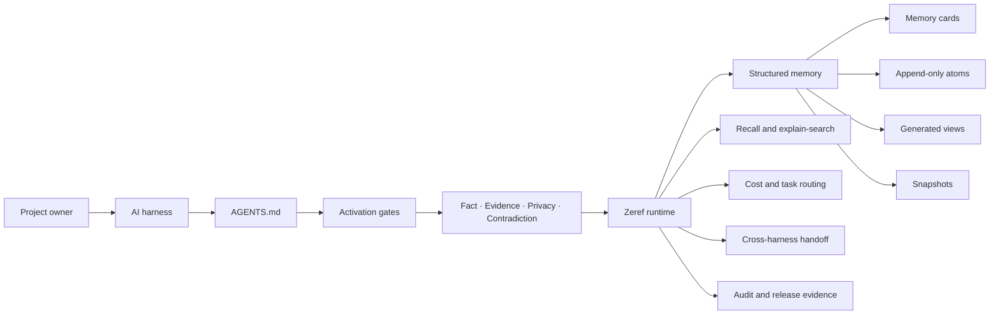

# Zeref Memory Engine

<p align="center">
  
</p>

<p align="center">
  <strong>Local-first memory, evidence, retrieval, and routing for AI-assisted engineering.</strong>
  <br>
  Shared project context across models, agents, sessions, and coding harnesses.
</p>

<p align="center">
  <a href="https://github.com/kanadhiayash/zeref-memory-engine/releases/tag/v1.0.0">
    
  </a>
  
  
  
  <a href="LICENSE">
    
  </a>
</p>

<p align="center">
  <a href="AGENTS.md">
    
  </a>
  <a href="docs/BENCHMARK_REPORT.md">
    
  </a>
  <a href="SECURITY.md">
    
  </a>
  <a href="https://github.com/kanadhiayash/zeref-memory-engine/actions/workflows/ci.yml">
    
  </a>
</p>

<p align="center">
  <a href="#overview">Overview</a> ·
  <a href="#quickstart">Quickstart</a> ·
  <a href="#core-capabilities">Capabilities</a> ·
  <a href="#architecture">Architecture</a> ·
  <a href="#operating-model">Operating model</a> ·
  <a href="#privacy-and-security">Security</a> ·
  <a href="#benchmarks-and-evidence">Benchmarks</a> ·
  <a href="#documentation">Documentation</a>
</p>

---

## Overview

Zeref Memory Engine gives AI-assisted projects a durable source of context that remains with the repository.

It stores decisions, facts, risks, tasks, preferences, sources, contradictions, and session state in local, inspectable files. AI tools can load the smallest relevant context, propose guarded updates, explain retrieved memory, and produce clean handoffs for the next session or harness.

Zeref combines four concerns that are often handled separately:

| Concern         | Zeref capability                                           |
| --------------- | ---------------------------------------------------------- |
| **Continuity**  | Persistent project memory across sessions and tools        |
| **Trust**       | Fact, evidence, privacy, and contradiction guards          |
| **Efficiency**  | Boundary-first retrieval and deterministic-first routing   |
| **Portability** | One canonical specification with multiple harness adapters |

Zeref is model-agnostic, harness-agnostic, privacy-first, and evidence-disciplined.

<p align="center">
  
</p>

---

## Why Zeref

AI-assisted engineering loses quality when project context resets, expands without structure, or moves between tools without a reliable handoff.

Zeref turns that context into a governed project resource.

| Workflow problem                                 | Zeref response                                                         |
| ------------------------------------------------ | ---------------------------------------------------------------------- |
| Every session starts without project history     | Boot from `memory/hot.md`, then load deeper context only when required |
| Large context windows become expensive and noisy | Use boundary-first retrieval and token-bounded artifacts               |
| Decisions lose their rationale                   | Store decisions with evidence, provenance, status, and links           |
| Old and new instructions conflict                | Surface contradictions for explicit arbitration                        |
| Sensitive information enters memory or handoffs  | Apply configurable privacy classification and redaction                |
| Routine operations consume expensive model calls | Route deterministic work to deterministic executors                    |
| Work moves between coding tools                  | Compile source-backed cross-harness handoffs                           |
| Repeated workflows remain informal               | Detect patterns and draft reviewable skills                            |
| External repositories influence architecture     | Evaluate lineage through sandboxed intake and adoption gates           |

---

## Quickstart

### Add Zeref to an existing project

Run these commands from the project root:

```bash
git clone https://github.com/kanadhiayash/zeref-memory-engine.git .zeref
python3 -m pip install -e .zeref
```

Initialize project memory:

```bash
zeref init \
  --name "My Project" \
  --privacy abstract \
  --tier auto \
  --parent ""
```

Inspect the active project state:

```bash
zeref --version
zeref status
zeref doctor
```

Point the active AI harness to:

```text
.zeref/AGENTS.md
```

### Add and recall structured memory

Create a guarded proposal:

```bash
zeref memory propose \
  "Public-facing copy should remain evidence-backed and privacy-safe." \
  --out proposal.json
```

Write the reviewed proposal:

```bash
zeref memory write --from proposal.json
```

Recall relevant memory:

```bash
zeref recall "public-facing copy"
```

Explain retrieval ranking:

```bash
zeref explain-search "public-facing copy"
```

### Verify the installation

```bash
python3 .zeref/scripts/zeref-validate.py
zeref release check
zeref doctor
```

See [`INSTALL.md`](INSTALL.md) for harness-specific installation and [`docs/GETTING_STARTED.md`](docs/GETTING_STARTED.md) for the complete CLI flow.

<p align="center">
  
</p>

---

## Core capabilities

### Memory and retrieval

* Structured memory cards for durable project knowledge.
* Append-only JSONL atoms for event-level records.
* SQLite-indexed recall with JSONL fallback.
* Evidence, confidence, authority, privacy, and status metadata.
* Search explanations that show why an item was returned.
* Memory history, archival, supersession, refinement, and health reports.
* Generated Markdown views for human review.
* Snapshots and project-local synchronization surfaces.

### Trust and governance

* **FactGuard** checks unsupported and overreaching claims.
* **EvidenceGuard** grades and audits source support.
* **PrivacyGuard** classifies and redacts sensitive material.
* **ContradictionGuard** surfaces conflicting active memory.
* Human arbitration for contradiction resolution.
* Append-only audit events.
* Public-claim and release-readiness checks.
* Configurable permission and sharing policies.

### Routing and orchestration

* Deterministic-first operation routing.
* Task-weight and model-tier classification.
* Token budgets for memory artifacts.
* Prompt classification and structured task briefs.
* Smallest-useful-stack skill routing.
* External tool reachability checks.
* Bounded local execution loops.
* Cross-model and cross-harness handoff compilation.

### Engineering quality

* Local release checks.
* Repository health diagnostics.
* Python version matrix testing.
* Fixture-based regression benchmarks.
* Privacy and version-consistency gates.
* Sandboxed lineage inspection.
* License and foreign-code containment checks.
* Reproducible benchmark commands and versioned rubrics.

---

## Architecture

Zeref uses one canonical behavior contract and multiple harness-specific entry points.



### Request lifecycle

```text
Project request
    ↓
Canonical project context
    ↓
Budget and task classification
    ↓
Smallest useful skill stack
    ↓
Fact, evidence, privacy, and contradiction checks
    ↓
Deterministic or model-assisted execution
    ↓
Guarded memory proposal
    ↓
Audit event, view, report, or handoff
```

---

## Operating model

Zeref separates responsibilities so deterministic code, model judgment, and human approval remain visible.

| Surface       | Responsibility                                                       |
| ------------- | -------------------------------------------------------------------- |
| `AGENTS.md`   | Canonical behavior, routing, privacy, memory, and handoff contract   |
| `agents/`     | Continuing responsibilities with explicit activation rules           |
| `skills/`     | Reviewable workflows with triggers, inputs, outputs, and risk levels |
| `zeref/`      | Deterministic Python runtime and CLI                                 |
| `commands/`   | User-facing command contracts                                        |
| `benchmarks/` | Local regression and conformance gates                               |
| `docs/`       | Architecture, trust, security, release, and risk evidence            |

### Agents and skills

Zeref currently defines six agents and fourteen canonical skills.

<details>
<summary><strong>View the current agent fleet</strong></summary>

| Agent                  | Responsibility                                                  |
| ---------------------- | --------------------------------------------------------------- |
| `memory-keeper`        | Owns guarded writes to project memory                           |
| `privacy-guardian`     | Enforces privacy mode, redaction, and sharing policy            |
| `sync-coordinator`     | Coordinates permissions, visibility, and parent synchronization |
| `evidence-curator`     | Reviews confidence, recency, and provenance                     |
| `pattern-observer`     | Detects repeated operational patterns                           |
| `handoff-orchestrator` | Packages state for session and harness transitions              |

</details>

<details>
<summary><strong>View the current skill inventory</strong></summary>

| Skill                      | Primary responsibility                                        |
| -------------------------- | ------------------------------------------------------------- |
| `project-setup`            | Initializes project memory, privacy, permissions, and budgets |
| `wiki-maintenance`         | Consolidates and refreshes human-readable memory              |
| `contradiction-resolution` | Coordinates explicit conflict arbitration                     |
| `privacy-abstraction`      | Produces privacy-safe memory and outbound content             |
| `parent-sync`              | Stages approved project-to-parent updates                     |
| `pattern-to-skill`         | Converts repeated patterns into reviewable skill drafts       |
| `memory-import-export`     | Migrates or backs up memory with provenance                   |
| `budget-governor`          | Classifies task weight and token policy                       |
| `skill-router`             | Selects the smallest useful task stack                        |
| `fleet-activator`          | Checks extended-tool availability                             |
| `prompt-context-engine`    | Converts raw requests into structured task briefs             |
| `handoff-compiler`         | Produces source-backed handoff artifacts                      |
| `caveman-handoff`          | Compresses cross-model handoff context                        |
| `evidence-grader`          | Grades claims and recommends evidence actions                 |

The canonical inventory lives in [`AGENTS.md`](AGENTS.md) and [`zeref-registry.json`](zeref-registry.json).

</details>

---

## Memory model

Zeref keeps project memory inside a predictable local structure.

```text
memory/
├── hot.md
├── index.md
├── MEMORY.md
├── DECISIONS.md
├── OPEN_QUESTIONS.md
├── RISKS.md
├── CONFLICTS.md
├── state/
├── views/
├── audit/
├── archive/
├── patterns/
├── snapshots/
├── sync/
└── raw/
```

### Boundary-first loading

Zeref loads context in stages:

1. `memory/hot.md` for immediate project state.
2. `memory/index.md` for domain navigation.
3. A specific file or section only when deeper context is required.
4. Raw sources only when the task requires direct evidence.

This keeps routine sessions focused while preserving access to deeper project history.

<p align="center">
  
</p>

---

## Guarded memory lifecycle

Durable memory follows an explicit lifecycle:

```text
Observe
  ↓
Classify
  ↓
Propose
  ↓
Check facts and evidence
  ↓
Apply privacy policy
  ↓
Scan for contradictions
  ↓
Review or approve
  ↓
Write atom or card
  ↓
Append audit event
  ↓
Refresh views and indexes
```

Useful commands:

```bash
zeref factguard scan README.md
zeref evidence check memory/
zeref contradictions scan memory/
zeref privacy scan docs/
zeref memory health --strict
zeref memory refine --dry-run
```

---

## Cross-harness operation

Zeref supports projects that move between AI coding tools.

| Harness                    | Activation surface                   |
| -------------------------- | ------------------------------------ |
| Claude Code                | Plugin, `AGENTS.md`, and `CLAUDE.md` |
| Codex                      | `AGENTS.md`                          |
| Cursor                     | `.cursor/rules/zeref.mdc`            |
| Gemini CLI and Antigravity | `GEMINI.md`                          |
| Windsurf                   | `.windsurfrules`                     |
| Aider                      | `.aider.conf.yml.example`            |
| Llama-family tools         | `LLAMA.md`                           |
| Human review               | Markdown and JSON handoff artifacts  |

Compile a handoff:

```bash
zeref handoff codex \
  --objective "Continue the current implementation from verified project state."
```

Available handoff targets:

```text
codex
claude
cursor
github
human
```

<p align="center">
  
</p>

---

## Privacy and security

Zeref uses conservative local defaults.

### Privacy controls

| File                                             | Control                                                |
| ------------------------------------------------ | ------------------------------------------------------ |
| [`PRIVACY.md`](PRIVACY.md)                       | Selects `exact`, `abstract`, or `local-only` behavior  |
| [`REDACT.md`](REDACT.md)                         | Defines sensitive classes and replacement rules        |
| [`SHARING_POLICY.md`](SHARING_POLICY.md)         | Controls external tools and connectors                 |
| [`config/PERMISSIONS.md`](config/PERMISSIONS.md) | Defines filesystem, network, and execution permissions |
| [`SECURITY.md`](SECURITY.md)                     | Defines private vulnerability reporting                |

The default privacy mode is `abstract`. Connector sharing begins disabled and requires explicit configuration.

### Sensitive-data handling

The deterministic privacy pipeline supports:

* Unicode normalization.
* Common homoglyph normalization.
* Base64 fragment inspection.
* Provider-shaped credential patterns.
* Email, personal information, financial data, internal path, client data, and proprietary identifier classes.
* Redaction metadata and audit trails.
* Strict privacy gates for release workflows.

Run a privacy audit:

```bash
zeref audit-privacy --strict
zeref privacy report --strict
```

Report security findings through the private channels defined in [`SECURITY.md`](SECURITY.md).

---

## Cost and model discipline

Zeref routes operations according to task weight, risk, and the amount of context required.

| Operation                          | Default handling          |
| ---------------------------------- | ------------------------- |
| Empty or unnecessary durable write | `no-write`                |
| Duplicate memory                   | Link the existing memory  |
| Metadata or status change          | Patch the existing atom   |
| Simple new memory                  | Deterministic atom append |
| Generated Markdown view            | Deterministic rendering   |
| Large memory input                 | Escalated review          |
| Contradiction resolution           | High-judgment review      |
| Privacy boundary decision          | High-judgment review      |
| Public claim                       | High-judgment review      |
| Architecture migration             | High-judgment review      |
| Benchmark verdict                  | High-judgment review      |
| Irreversible deletion              | High-judgment review      |

Inspect local routing policy:

```bash
zeref cost report
zeref cost estimate --text "..."
zeref cost route --operation memory-add --text "..."
zeref cost audit --strict
zeref route policy validate
```

Operational savings should be measured from real usage telemetry, including input tokens, output tokens, cache reads, retries, selected executor, and accepted-output rate.

---

## Bounded execution loops

Zeref can plan and run local bounded loops for repetitive review workflows.

Loops operate from an explicit contract:

* Defined goal.
* Selected team pack.
* Maximum iteration count.
* Recorded status.
* Generated report.
* Proposal-only durable-memory behavior.

```bash
zeref loop plan \
  "Review active memory for stale or unsupported claims." \
  --team audit \
  --max-iterations 3

zeref loop run \
  "Review active memory for stale or unsupported claims." \
  --team audit \
  --max-iterations 3

zeref loop status
zeref loop report
```

---

## Lineage governance

Zeref evaluates external repositories through a documented lineage process.

The lineage system provides:

* Intake schema validation.
* Default-branch source resolution.
* Sandboxed repository inspection.
* Source identity and commit recording.
* License metadata.
* Deterministic council verdicts.
* Critical adoption gates.
* High-priority optional boundaries.
* Reference-only battle tests.
* Foreign-code containment checks.
* Public-claim safety checks.

Lineage commands:

```bash
zeref lineage audit --csv path/to/lineage.csv

zeref lineage import \
  --csv path/to/lineage.csv \
  --sandbox \
  --latest-default \
  --dry-run

zeref lineage council \
  --csv path/to/lineage.csv \
  --strict
```

Read [`docs/LINEAGE_UPGRADE_ROADMAP.md`](docs/LINEAGE_UPGRADE_ROADMAP.md) for the current lineage strategy.

---

## Benchmarks and evidence

Zeref includes deterministic local gates for repository behavior and regression control.

The current benchmark surface covers:

* Portability.
* Adaptivity.
* Scalability.
* Retrieval.
* Trust.
* Token efficiency.
* Retrieval accuracy.
* Contradiction detection.
* Privacy safety.
* Prompt restructuring.
* Handoff success.
* Loop control.
* Memory refinement.
* Lineage intake.
* Foreign-code containment.
* Adoption coverage.
* Minimality pressure.
* Security containment.
* License boundaries.
* Public-claim safety.

### Evidence levels

| Level                   | Meaning                                                     |
| ----------------------- | ----------------------------------------------------------- |
| **Local deterministic** | Runs inside this repository against fixed fixtures          |
| **Fixture adapter**     | Represents an external benchmark schema with local fixtures |
| **External verified**   | Uses a named external dataset and reproducible commands     |
| **Comparative**         | Includes dated methodology and named comparison targets     |

Run all local benchmark gates:

```bash
python3 benchmarks/run-all.py
```

Run an individual axis:

```bash
python3 -m benchmarks.retrieval
python3 -m benchmarks.privacy_safety
python3 -m benchmarks.contradiction_detection
python3 -m benchmarks.public_claim_safety
```

Read:

* [`benchmarks/RUBRIC.md`](benchmarks/RUBRIC.md)
* [`docs/BENCHMARK_REPORT.md`](docs/BENCHMARK_REPORT.md)
* [`docs/BENCHMARK_ADAPTERS.md`](docs/BENCHMARK_ADAPTERS.md)
* [`docs/TRUST_AUDIT.md`](docs/TRUST_AUDIT.md)
* [`docs/RELEASE_GATES.md`](docs/RELEASE_GATES.md)

External performance claims are published after a named dataset run, reproducible environment capture, dated methodology, and independent review.

---

## Verification

Run the complete local verification sequence before release:

```bash
python3 -m pytest -q
python3 scripts/zeref-validate.py
python3 -m zeref audit
python3 -m zeref audit-privacy --strict
python3 -m zeref factguard report
python3 -m zeref evidence report
python3 -m zeref route policy validate
python3 -m zeref release check
python3 -m zeref doctor
python3 scripts/check-version-consistency.py
python3 benchmarks/run-all.py
git diff --check
```

Release evidence should include:

* Exact commit SHA.
* Python version.
* Command outputs.
* Benchmark report.
* Security and privacy results.
* Known risks.
* Rollback instructions.
* Public-claim review.

---

## Repository structure

| Path          | Responsibility                                                 |
| ------------- | -------------------------------------------------------------- |
| `AGENTS.md`   | Canonical system specification                                 |
| `zeref/`      | Python runtime and CLI                                         |
| `memory/`     | Local project memory and generated state                       |
| `agents/`     | Persistent responsibility definitions                          |
| `skills/`     | Triggered operating workflows                                  |
| `commands/`   | User-facing command contracts                                  |
| `team-packs/` | Bounded task-team configurations                               |
| `benchmarks/` | Deterministic benchmark runners and fixtures                   |
| `tests/`      | Runtime and CLI test suite                                     |
| `config/`     | Project, permission, budget, and routing configuration         |
| `references/` | Design lineage and reference material                          |
| `scripts/`    | Validation, migration, and release utilities                   |
| `docs/`       | Architecture, trust, security, risk, and release documentation |
| `.github/`    | CI, automation, issue templates, and repository policy         |

---

## Documentation

| Document                                                             | Purpose                                                        |
| -------------------------------------------------------------------- | -------------------------------------------------------------- |
| [`AGENTS.md`](AGENTS.md)                                             | Canonical behavior, agent, skill, memory, and routing contract |
| [`INSTALL.md`](INSTALL.md)                                           | Harness-specific installation                                  |
| [`docs/GETTING_STARTED.md`](docs/GETTING_STARTED.md)                 | CLI onboarding and first operations                            |
| [`docs/HARNESS_MATRIX.md`](docs/HARNESS_MATRIX.md)                   | Harness compatibility and activation                           |
| [`docs/HARDENING_OVERVIEW.md`](docs/HARDENING_OVERVIEW.md)           | Engineering hardening surfaces                                 |
| [`docs/RELEASE_GATES.md`](docs/RELEASE_GATES.md)                     | Release readiness requirements                                 |
| [`docs/BENCHMARK_REPORT.md`](docs/BENCHMARK_REPORT.md)               | Current local benchmark results                                |
| [`docs/BENCHMARK_ADAPTERS.md`](docs/BENCHMARK_ADAPTERS.md)           | External benchmark adapter status                              |
| [`docs/TRUST_AUDIT.md`](docs/TRUST_AUDIT.md)                         | Independent trust-axis review                                  |
| [`docs/RISK_LOG.md`](docs/RISK_LOG.md)                               | Open and accepted project risks                                |
| [`docs/PUBLIC_SAFE_COPY.md`](docs/PUBLIC_SAFE_COPY.md)               | Public claim and wording rules                                 |
| [`docs/LINEAGE_UPGRADE_ROADMAP.md`](docs/LINEAGE_UPGRADE_ROADMAP.md) | External repository lineage strategy                           |
| [`SECURITY.md`](SECURITY.md)                                         | Vulnerability reporting                                        |
| [`CONTRIBUTING.md`](CONTRIBUTING.md)                                 | Contribution workflow                                          |

<p align="center">
  
</p>

---

## Contributing

Contributions should preserve Zeref’s local-first, evidence-disciplined, and deterministic-first architecture.

Before opening a pull request:

1. Open an issue for significant architectural changes.
2. Keep the change focused on one reviewable concern.
3. Add or update tests.
4. Run the complete verification sequence.
5. Update affected documentation and public surfaces.
6. Record new risks and migration requirements.
7. Route security findings through private vulnerability reporting.

Read [`CONTRIBUTING.md`](CONTRIBUTING.md) before starting.

---

## License

Zeref Memory Engine is available under the [MIT License](LICENSE).

Bring your own models, harnesses, and project workflows.
