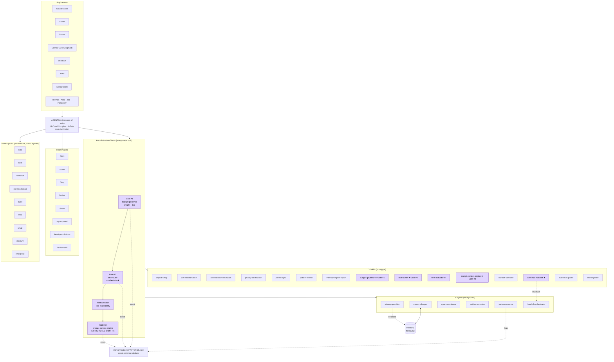

# Zeref Memory Engine

<p align="center"></p>

<p align="center">
  <strong>Local-first memory hardening layer for AI agents.</strong><br>
  Harness-agnostic · Model-agnostic · Privacy-first · Developer-first · Free to install
</p>

<p align="center">
  <a href="https://github.com/kanadhiayash/zeref-os/releases/tag/v1.0.0"></a>
  <a href="AGENTS.md#auto-activation-gates"></a>
  <a href="LICENSE"></a>
  <a href="docs/BENCHMARK_REPORT.md"></a>
  <a href="https://agents.md"></a>
  <a href="https://github.com/kanadhiayash/zeref-os/actions/workflows/ci.yml"></a>
</p>

---

## ⚠ Disclaimers (read first)

- **Zeref is not an operating system.** It is a **persistent memory and
  context layer** that plugs into your existing AI harness (Claude Code,
  Cursor, Codex, Gemini CLI, Windsurf, Aider, …). The legacy product
  name was "Zeref OS". The repo and the Claude plugin keep the
  `zeref-os` identifier purely for install-URL backward compatibility.
  The product name is now **Zeref Memory Engine** (short form: Zeref).
- **v1.0.0 is the current public release** under this name. The
  architecture (6 agents, 14 skills, 4-gate Auto-Activation chain,
  R6 Zero Context Loss invariant, three privacy modes, flat memory
  layout) is carried forward from the pre-public v2.6.x line. Pre-v1
  history is archived to
  [`kanadhiayash/zeref-os-archive`](https://github.com/kanadhiayash/zeref-os-archive).
- **Use at your own risk.** Zeref is MIT-licensed with no warranty. It
  reads and writes plain Markdown files in your project. You are
  responsible for what those files contain. The privacy scrubber is
  defense-in-depth, not a substitute for not pasting real production
  credentials into prompts.
- **Trust posture, honestly stated.**
  - Version surfaces machine-checked
    ([scripts/check-version-consistency.py](scripts/check-version-consistency.py)).
  - Pytest suite in [`tests/`](tests/).
  - Privacy scrubber covers 9 provider-shaped credential patterns plus
    9 built-in PII / financial / path classes.
  - CI actions pinned to commit SHAs **verified** via `gh api`.
  - Vuln reports route through GitHub Private Vulnerability Reporting
    + PGP fallback ([SECURITY.md](SECURITY.md)).
  - Local benchmark verdict published in
    [`docs/BENCHMARK_REPORT.md`](docs/BENCHMARK_REPORT.md):
    portability **10.00**, adaptivity **9.00**, scalability **10.00**,
    retrieval **10.00**, trust **9.70**. Overall **PASS**.
    External benchmark adapters are fixture-only unless separately marked
    verified.
  - Known gaps live in
    [`docs/RISK_LOG.md`](docs/RISK_LOG.md) and
    [`docs/TRUST_AUDIT.md`](docs/TRUST_AUDIT.md). Nothing is hidden.
- **Zeref is not a hosted service.** No server, no account, no cloud.
  Your memory lives in local Markdown in your repo. Optional MCP
  connectors can talk to hosted services — only if you explicitly
  enable them in `SHARING_POLICY.md`.
- **Plugin install verification is harness-dependent.** The
  `claude plugin install zeref-os@zeref-os` command works in interactive
  Claude Code; headless / cron environments may need manual steps.

---

## What is Zeref?

> Imagine you are an **architect** working on a major building. Every morning a different contractor shows up. Before they can lay a single brick, you have to re-explain the blueprint, the constraints, the decisions you and the prior contractor made, and what's already been built. Every conversation starts from zero.
>
> That is what working with AI assistants is like today. Each new session — Claude, Codex, Gemini, Cursor, Aider — starts blind. You re-explain your project, your decisions, your constraints. Context evaporates the moment the window closes.
>
> **Zeref is the local-first memory hardening layer for AI agents.** A per-project Markdown wiki plus structured local state that AI sessions read first, write to safely, and hand off cleanly. You build the blueprint once. Every AI tool you bring in reads from the same source. Your project memory travels with the project — not the tool.

> **Imagine you are a writer** drafting a novel across six months. Zeref keeps the world bible, character arcs, plot decisions, and rejected ideas in plain Markdown that any AI can read from and contribute to safely.
>
> **Imagine you are an engineer** maintaining a long-lived codebase. Zeref holds architectural decisions, open questions, risks, and contradictions in files your AI can navigate boundary-first — never re-loading everything.
>
> **Imagine you are a researcher** chasing a literature thread across weeks. Zeref captures graded evidence, source claims, and synthesis state in a wiki any session can resume from.

<p align="center"></p>

---

## What Zeref ships

- **14 disciplined skills**: every skill has a strict trigger; nothing always-on.
- **4-gate Auto-Activation chain** — every major task self-classifies cost, stack, prompt, and handoff before any token spend.
- **R6 Zero Context Loss** — every entity in your prompt (file path, tool name, error string, constraint) survives restructure, routing, and handoff.
- **Model-Tier Routing** — explicit Anthropic id mapping (Haiku 4.5 / Sonnet 4.6 / Opus 4.7) with cost-aware defaults.
- **9 on-demand team packs** (solo / build / research / red / audit / ship + new small / medium / enterprise size envelopes), max 4 agents, opt-in only.
- **3 privacy modes** — default `abstract`; connectors OFF by default.
- **Structured Memory Core** — SQLite-backed local state with source refs,
  confidence, authority, and explainable recall.
- **Guarded memory writes** — proposals pass FactGuard, EvidenceGuard,
  PrivacyGuard, and ContradictionGuard before storage.
- **Append-only audit logs** — local JSONL traces for writes, guard failures,
  redactions, routes, and release checks.
- **Reproducible test suite** — version consistency, privacy redaction,
  CLI contract, init scaffold, guarded writes, retrieval, guards, routing,
  release, doctor, and benchmark adapters.
- **Benchmark harness** — public rubric, machine-readable results, retrieval
  fixtures, and fixture-first external benchmark adapters.

<p align="center"></p>

---

## How it works



**★ = Auto-Activation Gate.** Four gates fire sequentially before any execution-model call. Output declared inline; user can override before token spend.

---

## Install in 5 minutes

```bash
# Claude Code
claude plugin marketplace add kanadhiayash/zeref-os
claude plugin install zeref-os@zeref-os
claude plugin list | grep "zeref-os.*1.0.0"

# Cursor
git clone https://github.com/kanadhiayash/zeref-os.git .zeref
mkdir -p .cursor/rules && cp .zeref/.cursor/rules/zeref.mdc .cursor/rules/

# Windsurf
git clone https://github.com/kanadhiayash/zeref-os.git .zeref && cp .zeref/.windsurfrules .

# Aider
git clone https://github.com/kanadhiayash/zeref-os.git .zeref && cp .zeref/.aider.conf.yml.example .aider.conf.yml

# Codex / Gemini / Antigravity / Llama family / Hermes / Amp / Zed / Perplexity
git clone https://github.com/kanadhiayash/zeref-os.git .zeref
# Point your harness at .zeref/AGENTS.md
```

Then in your harness: `/zeref-os:start` (or `/start`).

Verify the install works end-to-end:

```bash
python3 -m zeref --version          # zeref 1.0.0
python3 -m zeref status
python3 scripts/harness-probe.py    # 7/7 stubs present
python3 -m pytest -q
python3 benchmarks/run-all.py       # PASS
```

Full per-harness instructions: [`INSTALL.md`](INSTALL.md).
Per-harness verification matrix: [`docs/HARNESS_MATRIX.md`](docs/HARNESS_MATRIX.md).

<p align="center"></p>

---

## Memory model

Flat, per-project, plain Markdown. Boundary-first reads — never re-load the world.

```
project-root/
├── AGENTS.md                    (canonical source of truth)
├── CLAUDE.md / GEMINI.md / CODEX.md / LLAMA.md / ...   (harness stubs — defer to AGENTS.md)
├── PRIVACY.md                   (modes — default abstract)
├── REDACT.md                    (sensitive classes)
├── SHARING_POLICY.md            (connectors — OFF by default)
├── memory/
│   ├── hot.md                   (last 3 sessions, ≤500 words — read FIRST)
│   ├── index.md                 (domain index — read if hot insufficient)
│   ├── MEMORY.md                (agent-written session notes)
│   ├── DECISIONS.md             (confirmed decisions w/ provenance)
│   ├── OPEN_QUESTIONS.md        (unresolved questions)
│   ├── RISKS.md                 (identified risks w/ severity)
│   ├── CONFLICTS.md             (contradiction queue — user arbitrates)
│   ├── state/zeref.sqlite       (structured Memory Core state)
│   ├── views/                   (generated Markdown views)
│   ├── audit/*.jsonl            (append-only audit logs)
│   ├── archive/                 (superseded entries — never deleted)
│   ├── patterns/PATTERNS.jsonl  (append-only event log)
│   ├── snapshots/<iso>/         (point-in-time wiki state)
│   ├── sync/outbound/           (staged parent updates)
│   ├── sync/parent/             (received parent updates)
│   └── raw/                     (source material)
├── skills/<14 skills>/SKILL.md
├── agents/<6 agents>.md
├── commands/<8 commands>.md
├── team-packs/<9 packs>.md
└── config/                      (PROJECT, PERMISSIONS, PARENT_SYNC, BUDGET)
```

<p align="center"></p>

---

## Cross-harness handoff

Same project memory, different harness. The handoff package compiles `STATE.json` + `SUMMARY.md` + `NEXT.md`, then `caveman-handoff` compresses it for the target model — 40–60% smaller, R6 diff preserved.

| Harness | Activation file | Stub |
|---|---|---|
| Claude Code | `AGENTS.md` | `CLAUDE.md` |
| Codex | `AGENTS.md` | `CODEX.md` |
| Cursor | `AGENTS.md` | `.cursor/rules/zeref.mdc` |
| Gemini CLI / Antigravity | `AGENTS.md` | `GEMINI.md` |
| Windsurf | `AGENTS.md` | `.windsurfrules` |
| Aider | `AGENTS.md` | `.aider.conf.yml.example` |
| Llama family (Ollama / vLLM / Open WebUI) | `AGENTS.md` | `LLAMA.md` |
| Hermes · Amp · Zed · Perplexity | `AGENTS.md` | — |

<p align="center"></p>

---

## Privacy by default

Three root files govern privacy. All defaults err toward the user.

| File | Purpose | Default |
|---|---|---|
| `PRIVACY.md` | Modes: `exact` / `abstract` / `local-only` | **`abstract`** |
| `REDACT.md` | Sensitive classes: credentials, pii, internal_paths, client_data, financial, proprietary_code | credentials + pii + internal_paths enabled |
| `SHARING_POLICY.md` | Per-connector allowlist for MCP transmission | **all OFF** |

Every write to `memory/` and every external transmission passes through `privacy-guardian` first. The provider-shaped credential scrubber catches `sk-proj-*`, bare `sk-*`, `github_pat_*`, `ghp_*`, `xoxb-*`, `AIza*`, `AKIA*`, PEM private-key blocks, and natural-language `API key / secret key / access token` mentions — with adversarial bypass tests in [`tests/test_privacy_redaction.py`](tests/test_privacy_redaction.py).

---

## What Zeref is NOT

- **Not an operating system.** Zeref is a memory and context layer. The
  legacy name "Zeref OS" was a metaphor, not a system claim.
- **Not itself a harness.** Zeref plugs *into* your existing harness
  (Claude Code, Cursor, Codex, Gemini CLI, Windsurf, Aider, etc.).
- **Not a hosted service.** No server, no account, no cloud.
- **Not bundled with any MCP tools.** Recommendation-only. Zeref never
  installs a connector on your behalf.
- **Not a sprawling skill catalog.** 14 disciplined skills with strict
  triggers — not a fleet of specialists.
- **Not an always-on multi-agent council.** Team packs are on-demand
  only and capped at 4 agents. No background swarm.
- **Not dedicated to any single user or organization.** Free to install.
  Use with any project, any model you bring.

---

## The stack I use Zeref to control my operations

Zeref is the memory layer. These projects do the rest of the work. Each
gets explicit credit. Categorisation reflects how Zeref routes to them
in my own day-to-day stack — your usage may differ.

### Foundations + lineage

- **[karpathy / "Software 2.0" gist](https://gist.github.com/karpathy/442a6bf555914893e9891c11519de94f)**
  — conceptual lineage for AI-first engineering.
- **[kanadhiayash / zeref-os](https://github.com/kanadhiayash/zeref-os)**
  — this repo (the memory layer everything below routes through).

### Memory + knowledge graph

- **[AgriciDaniel / claude-obsidian](https://github.com/AgriciDaniel/claude-obsidian)**
  — Obsidian vault integration. Pairs with Zeref's flat-Markdown memory
  to keep long-running domain knowledge structured.
- **[safishamsi / graphify](https://github.com/safishamsi/graphify)**
  — turn any input (code, docs, papers, videos) into a persistent
  knowledge graph. Used when Zeref needs cross-file reasoning beyond
  flat Markdown.

### Operating doctrines + harnesses

- **[garrytan / gstack](https://github.com/garrytan/gstack)**
  — operating skills for shipping, reviewing, browsing, QA-ing inside
  Claude Code. Where Zeref carries memory, gstack carries motion.
- **[JuliusBrussee / caveman](https://github.com/JuliusBrussee/caveman)**
  — caveman-grammar compression. The same grammar Zeref's
  `caveman-handoff` skill uses for cross-model handoff.
- **[affaan-m / ECC](https://github.com/affaan-m/ECC)**
  — Engineering Council of Claude. Multi-perspective review patterns
  Zeref invokes when team pack = `red` or `audit`.

### Security workspaces

- **[gadievron / raptor](https://github.com/gadievron/raptor)**
  — autonomous security research harness.
- **[deonmenezes / mantishack](https://github.com/deonmenezes/mantishack)**
  — offensive security research.
- **[vmihalis / hacker-bob](https://github.com/vmihalis/hacker-bob)**
  — MCP-driven bug bounty agent.
- **[Z4nzu / hackingtool](https://github.com/Z4nzu/hackingtool)**
  — toolkit for authorised security testing. All four route through
  Zeref's `team-packs/red.md` (read-only) by default.

### Design + UX

- **[pbakaus / impeccable](https://github.com/pbakaus/impeccable)**
  — copy editing for production interfaces.
- **[nextlevelbuilder / ui-ux-pro-max-skill](https://github.com/nextlevelbuilder/ui-ux-pro-max-skill)**
  — UI/UX skill pack.
- **[Leonxlnx / taste-skill](https://github.com/Leonxlnx/taste-skill)**
  — aesthetic-judgment skill.
- **[motiondivision / motion](https://github.com/motiondivision/motion)**
  — animation library (the canonical React motion layer in my stack).
- **[heroui-inc / heroui](https://github.com/heroui-inc/heroui)**
  — component library.
- **[nowork-studio / NotFair](https://github.com/nowork-studio/NotFair)**
  — interface kit.

### Content + sites

- **[gohugoio / hugo](https://github.com/gohugoio/hugo)** — static-site
  generator for shipping written work.
- **[firecrawl / firecrawl](https://github.com/firecrawl/firecrawl)**
  — site → structured-data pipeline. Pairs with Zeref's
  `memory/raw/` ingest path.

### AI agent quality

- **[hardikpandya / stop-slop](https://github.com/hardikpandya/stop-slop)**
  — AI output quality discipline.
- **[0xNyk / council-of-high-intelligence](https://github.com/0xNyk/council-of-high-intelligence)**
  — multi-agent review patterns.

### Tool integrations

- **[ComposioHQ / composio](https://github.com/ComposioHQ/composio)**
  — tool / MCP connector layer Zeref recommends but does not bundle.

If your project belongs here and isn't listed, open an issue — I'll add
you.

---

## Help test it, fork it, scale it in a direction I haven't

Zeref ships at v1.0.0 with an explicit, conservative trust posture. It
is good enough for daily use. It is not finished. If any of the
following describes you, please get involved:

- **Test it.** Install Zeref in the harness you actually work in,
  follow the verification block above, and open an issue if anything
  in the [`docs/HARNESS_MATRIX.md`](docs/HARNESS_MATRIX.md) row for
  your harness doesn't hold up. Bonus points for adding the missing
  evidence.
- **Fork it for your own constraints.** Zeref defaults are tuned for a
  solo developer working across many harnesses. If you work inside a
  team, an enterprise, an academic lab, a security workspace, or a
  creative studio, fork the repo, change the defaults, and ship your
  own variant. The MIT licence is permissive for exactly this reason.
- **Scale it in a new direction.** Direction prompts:
  - A genuinely shared memory layer across team members (CRDT? Yjs?).
  - A multi-device sync path (Zeref currently treats one project root
    as authoritative).
  - A first-class GUI for browsing `memory/`.
  - A harness adapter for the next-generation AI tool that doesn't
    exist yet at v1.0.0.
  - Higher coverage on the privacy scrubber (mathematical-italic and
    fullwidth homoglyph table, more provider patterns).
  - In-process CLI coverage (see
    [`docs/RISK_LOG.md`](docs/RISK_LOG.md) R-007).
  - PRs against
    [`benchmarks/RUBRIC.md`](benchmarks/RUBRIC.md) — the rubric is
    public and contestable.

Open an issue with a short proposal first if the direction is large.
Small PRs (typo fixes, doc clarifications, new tests for an existing
pattern) — just send them.

---

## Documentation

- **[GitHub Wiki](https://github.com/kanadhiayash/zeref-os/wiki)** —
  Architecture, Memory model, Privacy model, Team packs, Pattern
  detection, Installation, FAQ, Glossary, Inspirations.
- **[`AGENTS.md`](AGENTS.md)** — canonical agent spec.
- **[`docs/GETTING_STARTED.md`](docs/GETTING_STARTED.md)** — local setup and
  verification commands.
- **[`docs/HARDENING_OVERVIEW.md`](docs/HARDENING_OVERVIEW.md)** — v1.1
  hardening surfaces and public-safe release position.
- **[`INSTALL.md`](INSTALL.md)** — per-harness install.
- **[`MIGRATION.md`](MIGRATION.md)** — migration paths from pre-v1.
- **[`CHANGELOG.md`](CHANGELOG.md)** — release notes.
- **[`SECURITY.md`](SECURITY.md)** — private vulnerability reporting.
- **[`CONTRIBUTING.md`](CONTRIBUTING.md)** — branch naming, commit
  scopes, never-delete-branch policy.
- **[`GITHUB_OS.md`](GITHUB_OS.md)** — per-repo doctrine.
- **[`docs/BENCHMARK_REPORT.md`](docs/BENCHMARK_REPORT.md)** —
  local benchmark verdict.
- **[`docs/BENCHMARK_ADAPTERS.md`](docs/BENCHMARK_ADAPTERS.md)** —
  fixture-first external benchmark adapter status.
- **[`docs/RELEASE_GATES.md`](docs/RELEASE_GATES.md)** — local release
  readiness gates.
- **[`docs/PUBLIC_SAFE_COPY.md`](docs/PUBLIC_SAFE_COPY.md)** — public-safe
  copy rules.
- **[`docs/DOCTOR.md`](docs/DOCTOR.md)** — local health checks.
- **[`docs/TRUST_AUDIT.md`](docs/TRUST_AUDIT.md)** — independent trust
  re-grade.
- **[`docs/RISK_LOG.md`](docs/RISK_LOG.md)** — open risks + mitigations.
- **[`docs/PIVOT_LOG.md`](docs/PIVOT_LOG.md)** — pre-v1 design lineage.
- **[`docs/HARNESS_MATRIX.md`](docs/HARNESS_MATRIX.md)** — per-harness
  boot evidence.

<p align="center"></p>

---

## License

MIT licensed. Free to install — bring your own models, your own
harness. No warranty.

---

<p align="center"><sub>Named after <a href="https://fairytail.fandom.com/wiki/Zeref_Dragneel">Zeref Dragneel</a>. Carry your memory with you.</sub></p>
