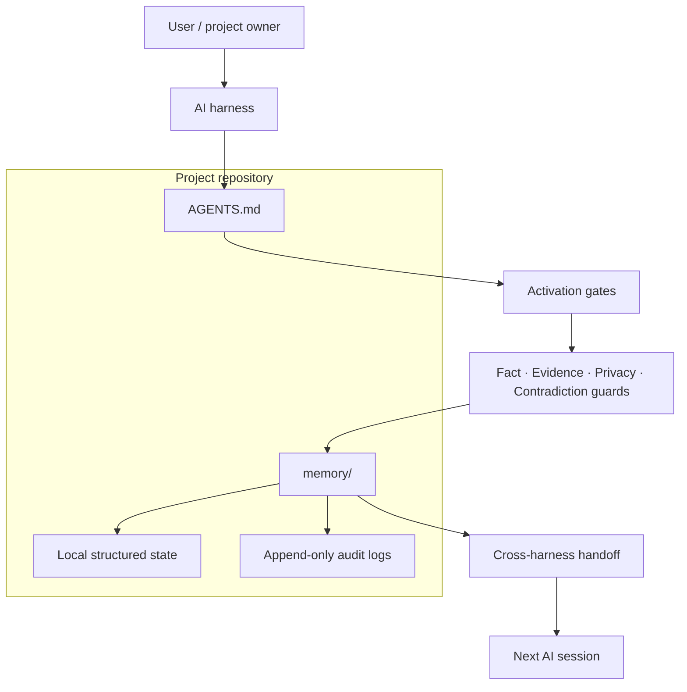

<!-- privacy-audit: allow-file "Public hero doc. Names author + character reference (Fairy Tail) + documents install commands with example env-var names. No user memory." -->

# Zeref Memory Engine

<p align="center">
  <a href="https://github.com/kanadhiayash/zeref-memory-engine/releases/tag/v2.0.0-alpha.2"></a>
  
</p>

<p align="center">
  <strong>Local-first memory for AI-assisted work.</strong><br>
  Harness-agnostic · Model-agnostic · Privacy-first · Evidence-disciplined · Benchmark-gated
</p>

<p align="center">
  <a href="LICENSE"></a>
  <a href="AGENTS.md"></a>
  <a href="docs/BENCHMARK_REPORT.md"></a>
  <a href="SECURITY.md"></a>
  <a href="https://github.com/kanadhiayash/zeref-memory-engine/actions/workflows/ci.yml"></a>
</p>

<p align="center">
  <a href="#what-zeref-does">What it does</a> ·
  <a href="#quickstart">Quickstart</a> ·
  <a href="#architecture">Architecture</a> ·
  <a href="#privacy-and-security">Security</a> ·
  <a href="#benchmarks">Benchmarks</a> ·
  <a href="#documentation">Docs</a>
</p>

---

## What Zeref does

Zeref gives AI tools a project memory they can read first, write to safely, and hand off cleanly.

It prevents every new AI session from starting blind. Instead of re-explaining the same project context, decisions, constraints, risks, and open questions, Zeref keeps that context inside the project.

Zeref is:

- **Local-first**: memory lives with the project.
- **Harness-agnostic**: multiple AI tools can point to the same memory source.
- **Privacy-first**: external sharing is off unless explicitly allowed.
- **Evidence-disciplined**: facts, assumptions, unknowns, and risks stay separate.
- **Guarded**: memory writes can pass through fact, evidence, privacy, and contradiction checks.
- **Auditable**: important events write local append-only traces.
- **Benchmark-gated**: release readiness depends on deterministic local checks.

Zeref is not:

- an operating system,
- a hosted service,
- a model provider,
- a vector database,
- a replacement for human review,
- or a public benchmark report claim.

<p align="center">
  
</p>

---

## Why it exists

AI work breaks down when context resets.

A project usually has decisions, constraints, user preferences, risks, contradictions, source material, active tasks, abandoned paths, release gates, privacy rules, and handoff notes.

Most AI sessions forget those boundaries unless you manually reload them.

Zeref makes project memory explicit, local, and reviewable.


## Name and inspiration

The name Zeref nods to a fictional scholar associated with long-lived knowledge. The memory-engine idea is the practical version of that: durable local context, explicit decisions, guarded writes, and clean handoffs so project memory survives beyond any single AI chat.

---

## What Zeref ships

| Surface | Purpose |
|---|---|
| `AGENTS.md` | Canonical behavior contract for AI harnesses. |
| `memory/` | Project memory, decisions, risks, conflicts, raw sources, and generated views. |
| `zeref/` | Python reference runtime and CLI. |
| `skills/` | Task-specific operating skills. |
| `agents/` | Background agent role definitions. |
| `commands/` | User-facing command contracts. |
| `benchmarks/` | Deterministic local benchmark suite and adapters. |
| `docs/` | Architecture, hardening, security, risk, benchmark, and release docs. |

Core capabilities:

- Structured Memory Core.
- Guarded memory writes.
- FactGuard.
- EvidenceGuard.
- PrivacyGuard.
- ContradictionGuard.
- Append-only audit logs.
- Deterministic routing and cost policy.
- Cross-harness handoffs.
- Local release checks.
- Fixture-first benchmark adapters.

---

## Quickstart

Clone Zeref into a project:

```bash
git clone https://github.com/kanadhiayash/zeref-memory-engine.git .zeref
```

Point your AI harness at:

```text
.zeref/AGENTS.md
```

For Claude Code plugin compatibility, the legacy `zeref-os` identifier may still appear in install paths. The product name is **Zeref Memory Engine**.

Verify locally:

```bash
python3 -m zeref --version
python3 -m zeref status
python3 scripts/zeref-validate.py
python3 -m pytest -q
python3 benchmarks/run-all.py
```

Read the full setup guide:

- [`INSTALL.md`](INSTALL.md)
- [`docs/GETTING_STARTED.md`](docs/GETTING_STARTED.md)
- [`docs/HARNESS_MATRIX.md`](docs/HARNESS_MATRIX.md)

<p align="center">
  
</p>

---

## Architecture

Zeref uses one canonical spec and multiple harness stubs.



Memory layout:

```text
memory/
  hot.md
  index.md
  MEMORY.md
  DECISIONS.md
  OPEN_QUESTIONS.md
  RISKS.md
  CONFLICTS.md
  state/
  views/
  audit/
  archive/
  patterns/
  snapshots/
  sync/
  raw/
```

<p align="center">
  
</p>

---

## Cross-harness handoff

Zeref is built for projects that move across tools.

| Harness | Activation file |
|---|---|
| Claude Code | `AGENTS.md` |
| Codex | `AGENTS.md` |
| Cursor | `.cursor/rules/zeref.mdc` |
| Gemini CLI / Antigravity | `GEMINI.md` |
| Windsurf | `.windsurfrules` |
| Aider | `.aider.conf.yml.example` |
| Llama-family tools | `LLAMA.md` |

<p align="center">
  
</p>

---

## Privacy and security

Zeref defaults to conservative privacy behavior.

| File | Purpose |
|---|---|
| [`PRIVACY.md`](PRIVACY.md) | Privacy mode. Default is `abstract`. |
| [`REDACT.md`](REDACT.md) | Sensitive classes and redaction rules. |
| [`SHARING_POLICY.md`](SHARING_POLICY.md) | Connector and external sharing policy. |
| [`SECURITY.md`](SECURITY.md) | Vulnerability reporting policy. |

Security issues should be reported privately. Do not open public issues for vulnerabilities.

Security and governance docs:

- [`SECURITY.md`](SECURITY.md)
- [`docs/PUBLIC_SAFE_COPY.md`](docs/PUBLIC_SAFE_COPY.md)
- [`docs/RELEASE_GATES.md`](docs/RELEASE_GATES.md)

---

## Benchmarks

Zeref includes deterministic local benchmark gates and fixture-first adapters for external memory benchmark formats.

Current benchmark reports are local and repo-scoped. They are **not** public benchmark report claims.

Read:

- [`benchmarks/RUBRIC.md`](benchmarks/RUBRIC.md)
- [`docs/BENCHMARK_REPORT.md`](docs/BENCHMARK_REPORT.md)
- [`docs/BENCHMARK_ADAPTERS.md`](docs/BENCHMARK_ADAPTERS.md)
- [`docs/RELEASE_GATES.md`](docs/RELEASE_GATES.md)

Benchmark posture:

| Status | Meaning |
|---|---|
| Local deterministic | Runs inside this repo with fixed fixtures. |
| Fixture adapter | External benchmark format is represented by local fixtures. |
| External verified | Only valid after a named external dataset run with reproducible commands. |
| Comparative claim | Only valid with dated methodology and named comparison targets. |

---

## Project topics

Recommended GitHub topics:

```text
ai-memory
agent-memory
local-first
privacy-first
ai-agents
agentic-workflows
llm-tools
developer-tools
python
benchmarking
evidence
knowledge-management
```

Set them with GitHub CLI:

```bash
gh repo edit kanadhiayash/zeref-memory-engine \
  --add-topic ai-memory \
  --add-topic agent-memory \
  --add-topic local-first \
  --add-topic privacy-first \
  --add-topic ai-agents \
  --add-topic agentic-workflows \
  --add-topic llm-tools \
  --add-topic developer-tools \
  --add-topic python \
  --add-topic benchmarking \
  --add-topic evidence \
  --add-topic knowledge-management
```

---

## Documentation

| Document | Purpose |
|---|---|
| [`AGENTS.md`](AGENTS.md) | Canonical agent and harness behavior. |
| [`INSTALL.md`](INSTALL.md) | Install instructions. |
| [`docs/GETTING_STARTED.md`](docs/GETTING_STARTED.md) | Local setup and verification. |
| [`docs/HARDENING_OVERVIEW.md`](docs/HARDENING_OVERVIEW.md) | Hardening surfaces. |
| [`docs/PUBLIC_SAFE_COPY.md`](docs/PUBLIC_SAFE_COPY.md) | Public claim rules. |
| [`docs/RELEASE_GATES.md`](docs/RELEASE_GATES.md) | Release readiness checks. |
| [`docs/RISK_LOG.md`](docs/RISK_LOG.md) | Known risks and mitigations. |
| [`docs/TRUST_AUDIT.md`](docs/TRUST_AUDIT.md) | Trust posture notes. |
| [`docs/archive/README.md`](docs/archive/README.md) | Public-safe archive index. |

<p align="center">
  
</p>

---

## Contributing

Open an issue before large changes. Keep PRs focused. Security issues must be reported privately.

Read:

- [`CONTRIBUTING.md`](CONTRIBUTING.md)
- [`SECURITY.md`](SECURITY.md)

---

## License

MIT. Bring your own models, harnesses, and workflows. No warranty.
