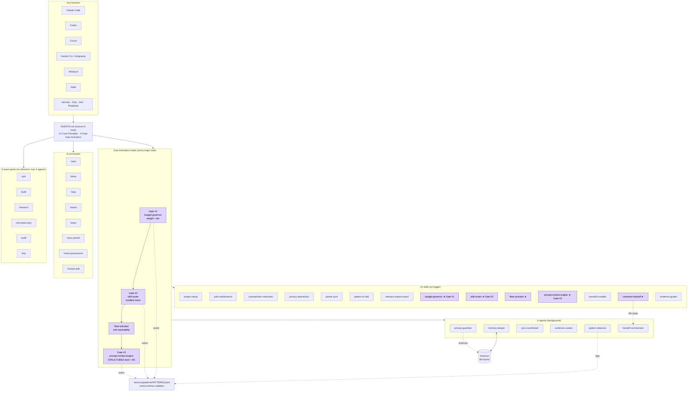
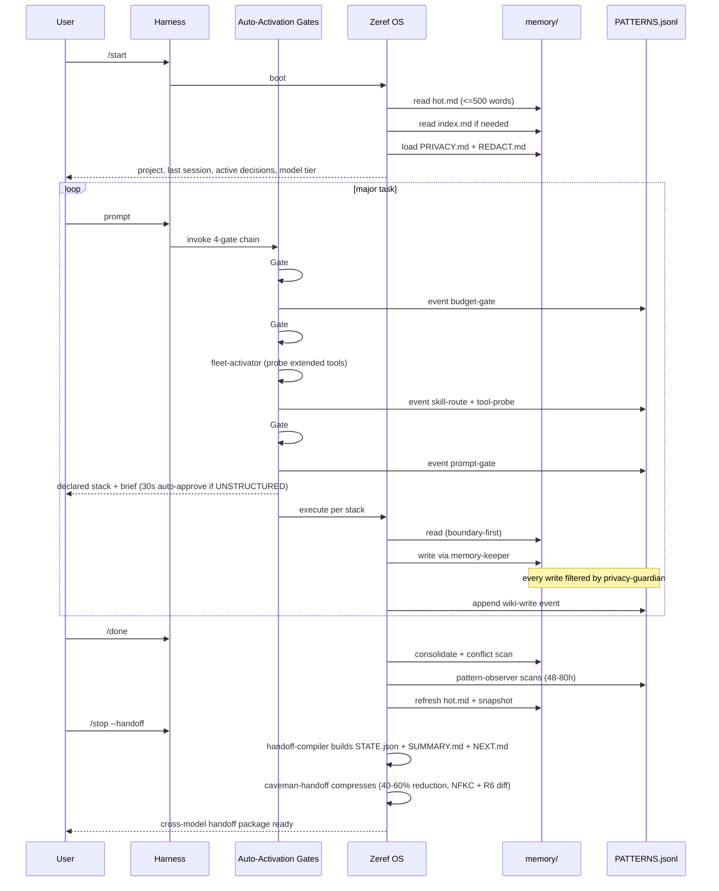

# Zeref OS

<p align="center"></p>

<p align="center">
  <strong>Local-first context and memory engine for AI-assisted work.</strong><br>
  Harness-agnostic · Model-agnostic · Privacy-first · Developer-first · Free to install
</p>

<p align="center">
  <a href="https://github.com/kanadhiayash/zeref-os/releases/tag/v1.0.0"></a>
  <a href="AGENTS.md#auto-activation-gates-v26"></a>
  <a href="LICENSE"></a>
  <a href="https://agents.md"></a>
  <a href="https://github.com/kanadhiayash/zeref-os/actions/workflows/ci.yml"></a>
</p>

> **Zeref OS Command Center (Notion)**: <https://copper-tv-288.notion.site/Zeref-Agent-OS-Command-Center-358d695d836a81af9f6adf30770217c3>

---

## What is Zeref OS?

> Imagine you are an **architect** working on a major building. Every morning a different contractor shows up. Before they can lay a single brick, you have to re-explain the blueprint, the constraints, the decisions you and the prior contractor made, and what's already been built. Every conversation starts from zero.
>
> That is what working with AI assistants is like today. Each new session — Claude, Codex, Gemini, Cursor, Aider — starts blind. You re-explain your project, your decisions, your constraints. Context evaporates the moment the window closes.
>
> **Zeref OS is the persistent memory layer that fixes this.** A per-project markdown wiki that AI sessions read first, write to safely, and hand off cleanly. You build the blueprint once. Every AI tool you bring in reads from the same source. Your project memory travels with the project — not the tool.

> **Imagine you are a writer** drafting a novel across six months. Zeref OS keeps the world bible, character arcs, plot decisions, and rejected ideas in plain markdown that any AI can read from and contribute to safely.
>
> **Imagine you are an engineer** maintaining a long-lived codebase. Zeref OS holds architectural decisions, open questions, risks, and contradictions in files your AI can navigate boundary-first — never re-loading everything.
>
> **Imagine you are a researcher** chasing a literature thread across weeks. Zeref OS captures graded evidence, source claims, and synthesis state in a wiki any session can resume from.

<p align="center"></p>

---

## What v1.0.0 ships

- **14 disciplined skills**: every skill has a strict trigger; nothing always-on.
- **4-gate Auto-Activation chain** — every major task self-classifies cost, stack, prompt, and handoff before any token spend.
- **R6 Zero Context Loss** — every entity in your prompt (file path, tool name, error string, constraint) survives restructure, routing, and handoff.
- **Model-Tier Routing** — explicit Anthropic id mapping (Haiku 4.5 / Sonnet 4.6 / Opus 4.7) with cost-aware defaults.
- **6 on-demand team packs** (solo / build / research / red / audit / ship), max 4 agents, opt-in only.
- **3 privacy modes** — default `abstract`; connectors OFF by default.

<p align="center"></p>

---

## How it works



**★ = Auto-Activation Gate.** Four gates fire sequentially before any execution-model call. Output declared inline; user can override before token spend.

### Session lifecycle



---

## Install in 5 minutes

```bash
# Claude Code
claude plugin marketplace add kanadhiayash/zeref-os
claude plugin install zeref-os@zeref-os

# Cursor
git clone https://github.com/kanadhiayash/zeref-os.git .zeref
mkdir -p .cursor/rules && cp .zeref/.cursor/rules/zeref.mdc .cursor/rules/

# Windsurf
git clone https://github.com/kanadhiayash/zeref-os.git .zeref && cp .zeref/.windsurfrules .

# Aider
git clone https://github.com/kanadhiayash/zeref-os.git .zeref && cp .zeref/.aider.conf.yml.example .aider.conf.yml

# Codex / Gemini / Antigravity / Hermes / Amp / Zed / Perplexity
git clone https://github.com/kanadhiayash/zeref-os.git .zeref
# Point your harness at .zeref/AGENTS.md
```

Then in your harness: `/zeref-os:start` (or `/start`).

Full per-harness instructions: [`INSTALL.md`](INSTALL.md).

<p align="center"></p>

---

## Memory model

Flat, per-project, plain markdown. Boundary-first reads — never re-load the world.

```
project-root/
├── AGENTS.md                    (canonical source of truth)
├── CLAUDE.md / GEMINI.md / ...  (harness stubs — defer to AGENTS.md)
├── PRIVACY.md                   (modes — default abstract)
├── REDACT.md                    (sensitive classes)
├── SHARING_POLICY.md            (connectors — OFF by default)
├── memory/
│   ├── hot.md                   (last 3 sessions, ≤500 words — read FIRST)
│   ├── index.md                 (domain index — read if hot insufficient)
│   ├── MEMORY.md                (agent-written session notes)
│   ├── DECISIONS.md             (confirmed decisions w/ provenance)
│   ├── OPEN_QUESTIONS.md        (unresolved questions)
│   ├── RISKS.md                 (identified risks w/ severity)
│   ├── CONFLICTS.md             (contradiction queue — user arbitrates)
│   ├── archive/                 (superseded entries — never deleted)
│   ├── patterns/PATTERNS.jsonl  (append-only event log)
│   ├── snapshots/<iso>/         (point-in-time wiki state)
│   ├── sync/outbound/           (staged parent updates)
│   ├── sync/parent/             (received parent updates)
│   └── raw/                     (source material)
├── skills/<14 skills>/SKILL.md
├── agents/<6 agents>.md
├── commands/<8 commands>.md
├── team-packs/<6 packs>.md
└── config/                      (PROJECT, PERMISSIONS, PARENT_SYNC, BUDGET)
```

<p align="center"></p>

---

## Cross-harness handoff

Same project memory, different harness. The handoff package compiles `STATE.json` + `SUMMARY.md` + `NEXT.md`, then `caveman-handoff` compresses it for the target model — 40–60% smaller, R6 diff preserved.

| Harness | Activation file | Stub |
|---|---|---|
| Claude Code | `AGENTS.md` | `CLAUDE.md` |
| Codex | `AGENTS.md` | — |
| Cursor | `AGENTS.md` | `.cursor/rules/zeref.mdc` |
| Gemini CLI / Antigravity | `AGENTS.md` | `GEMINI.md` |
| Windsurf | `AGENTS.md` | `.windsurfrules` |
| Aider | `AGENTS.md` | `.aider.conf.yml.example` |
| Hermes · Amp · Zed · Perplexity | `AGENTS.md` | — |

<p align="center"></p>

---

## Privacy by default

Three root files govern privacy. All defaults err toward the user.

| File | Purpose | Default |
|---|---|---|
| `PRIVACY.md` | Modes: `exact` / `abstract` / `local-only` | **`abstract`** |
| `REDACT.md` | Sensitive classes: credentials, pii, internal_paths, client_data, financial, proprietary_code | credentials + pii + internal_paths enabled |
| `SHARING_POLICY.md` | Per-connector allowlist for MCP transmission | **all OFF** |

Every write to `memory/` and every external transmission passes through `privacy-guardian` first.

---

## Inspiration

Zeref OS is named after **Zeref Dragneel** from *Fairy Tail* — the immortal scholar whose ancient knowledge transcended form, time, and faction. He carried centuries of context with him; he never started from zero.

That is the design north star. AI sessions today start from zero, every time. You re-explain your project every conversation. You lose decisions to context window resets. You can't switch from Claude to Codex to Gemini to Cursor without abandoning your project memory.

Zeref OS is built in that lineage: **long-horizon memory, faithful to the user's accumulated decisions, portable across every AI harness**.

---

## What v1.0.0 is NOT

- **Not itself a harness.** Zeref OS plugs *into* your existing harness (Claude Code, Cursor, Codex, Gemini CLI, Windsurf, Aider, etc.). It is the memory layer they read — not a replacement.
- **Not a hosted service.** No server, no account, no cloud. Your memory lives in local markdown files in your repo. Optional MCP connectors can talk to hosted services — but only after you explicitly enable them in `SHARING_POLICY.md`.
- **Not bundled with any MCP tools.** Recommendation-only. Zeref OS never installs a connector on your behalf.
- **Not a sprawling skill catalog.** 14 disciplined skills with strict triggers — not a fleet of specialists.
- **Not an always-on multi-agent council.** Team packs are on-demand only and capped at 4 agents. No background swarm.
- **Not dedicated to any single user or organization.** Free to install. Use with any project, any model you bring.

---

## Documentation

- **[GitHub Wiki](https://github.com/kanadhiayash/zeref-os/wiki)** — Architecture, Memory model, Privacy model, Team packs, Pattern detection, Installation, FAQ, Glossary, Inspirations
- **[`AGENTS.md`](AGENTS.md)** — canonical agent spec
- **[`INSTALL.md`](INSTALL.md)** — per-harness install
- **[`MIGRATION.md`](MIGRATION.md)** — migration paths
- **[`CHANGELOG.md`](CHANGELOG.md)** — release notes
- **[`GITHUB_OS.md`](GITHUB_OS.md)** — per-repo doctrine

<p align="center"></p>

---

## License

MIT licensed. Free to install — bring your own models, your own harness.

---

<p align="center"><sub>Inspired by <a href="https://fairytail.fandom.com/wiki/Zeref_Dragneel">Zeref Dragneel</a>. Carry your memory with you.</sub></p>
