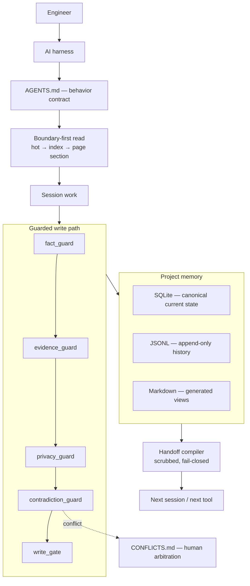

<!-- privacy-audit: allow-file "Public hero doc. Documents install commands with example env-var names. No user memory." -->

# Zeref Memory Engine

<p align="center">
  
  
</p>

<p align="center">
  <a href="LICENSE"></a>
  <a href="AGENTS.md"></a>
  <a href="SECURITY.md"></a>
  <a href="https://github.com/kanadhiayash/zeref-memory-engine/actions/workflows/zrf-verify.yml"></a>
</p>

<p align="center">
  <a href="#what-it-is">What it is</a> ·
  <a href="#quickstart">Quickstart</a> ·
  <a href="#architecture">Architecture</a> ·
  <a href="#guarantees-and-how-they-are-enforced">Guarantees</a> ·
  <a href="#limitations">Limitations</a> ·
  <a href="#documentation">Docs</a>
</p>

---

## What it is

Zeref is a local-first memory engine that gives AI coding agents a persistent, reviewable project memory stored as plain files in your repository. It is for engineers who work across more than one AI tool and are tired of re-explaining the same decisions, constraints, and dead ends at the start of every session.

Memory lives in your project, in Markdown and SQLite you can read and diff. Sessions read it before they act, write to it through a guarded path, and hand it to the next session in a scrubbed, portable form.

Current release: **v2.0.0-alpha.2**. Alpha software — interfaces may change. See [Limitations](#limitations).

**Zeref is:**

- **Local-first** — canonical state is files on your disk, inside your repo.
- **Boundary-first on reads** — a session reads a small hot file, then an index, then one named page section. Context stays bounded as the project grows.
- **Human-arbitrated on conflicts** — when a new claim contradicts a stored one, the write halts and both sides are queued for you. Nothing auto-resolves.
- **Deterministic on privacy** — redaction is regex and Unicode normalization in code, not a model asked to be careful.
- **Guarded on writes** — writes pass fact, evidence, privacy, and contradiction checks before a write gate admits them.
- **Provider-neutral by construction** — core code names reasoning classes, never vendor model IDs.

**Zeref is not:**

- an operating system,
- a hosted service,
- an inference layer or model provider,
- a vector database,
- a replacement for human review,
- or a source of published benchmark scores.

---

## How do I give an AI agent persistent project memory?

Point every AI tool you use at the same `AGENTS.md` in your project root, and let Zeref own the files underneath it. `AGENTS.md` is the behavior contract: it tells a session what to read first, what it may write, and what it must stop and ask about. Because the contract and the memory both live in the repo, any harness that can read a Markdown instruction file participates without per-tool syncing.

The practical effect is that a session starts with your project's decisions, open questions, risks, and conflicts already loaded, and ends by writing what it learned back to the same place.

## What is local-first LLM memory?

Local-first LLM memory keeps the canonical copy of an agent's memory on your machine, in your version control, rather than in a vendor's account. Zeref stores current state in SQLite, append-only history in JSONL, and human-readable views in Markdown, all inside the project.

Nothing leaves the machine unless you turn sharing on. External transmission is off by default, and `local-only` privacy mode blocks it outright.

## How do I stop an AI assistant from forgetting project decisions?

Write decisions to a durable store the assistant reads at the start of every session, and make contradicting one of them an event that requires your judgment. Zeref records decisions with provenance and an evidence grade, and detects when a later claim conflicts with an earlier one.

A detected conflict does not overwrite and does not silently pick a winner. It halts the write, records both sides with their provenance, and waits for you to arbitrate.

## How do I share context between Claude Code, Cursor, and Codex?

Compile a handoff artifact and open it in the next tool. Zeref's handoff compiler targets five destinations — `codex`, `claude`, `cursor`, `github`, and `human` — and scrubs the payload against your privacy policy on the way out.

Handoffs fail closed: only atoms explicitly classed public-safe are exported by default. Anything unclassified is treated as private and withheld, and anything marked local-only never leaves the machine regardless of flags.

## What is agent memory that survives context loss?

It is memory that gets re-read rather than re-explained. Because it lives on disk instead of in a context window, ending a session, switching models, or exhausting a context limit does not destroy accumulated project knowledge.

The next session performs a boundary-first read and resumes from stored state.

---

## Architecture

Zeref sits between the AI harness and your project's memory files. The harness supplies the model and the editor; Zeref supplies the memory, the guards, and the policy.



### The store invariant

One question — "what is the source of truth?" — has one answer, and every surface derives from it:

| Layer | Role |
|---|---|
| SQLite | Canonical current state. |
| JSONL | Canonical append-only history. Never edited in place. |
| Markdown | Generated human-readable view. Carries a do-not-edit header. |
| TOON | Optional generated model-input view. |

See [`docs/adr/ADR-0001-canonical-store.md`](docs/adr/ADR-0001-canonical-store.md).

### Reading is bounded

A session does not load the project to answer a question about the project. It reads `memory/hot.md` first, consults `memory/index.md` only if hot is insufficient, then loads one named section of one named page. The cost of a read is a function of the question, not of how long the project has been running.

### Harness adapters

Adapters detect a harness, report its health honestly, and project context into the file that harness reads. Registered adapters cover Claude Code, Codex, Gemini CLI, Hermes, Kimi Code, Odysseus, and Grok.

Each adapter declares an enforcement level rather than implying uniform control:

| Level | Meaning |
|---|---|
| Embedded | Zeref authorizes operations through native hooks or controlled subprocesses. |
| Sidecar / proxy | Zeref enforces only work routed through its own CLI, MCP server, or proxy. |
| Context-only | Zeref can supply context and instructions but cannot guarantee enforcement. |

An adapter whose module is absent reports `detected=false` with a stated reason rather than failing on import.

### Model routing is by reasoning class

Core code and schemas never name a vendor model. A task carries a criticality; criticality resolves to a reasoning class; a provider descriptor maps that class to a concrete model ID at the edge.

| Criticality | Reasoning class |
|---|---|
| LOW | `fast` |
| MEDIUM | `balanced` |
| HIGH | `deep` |
| CRITICAL | `frontier` |

`local` and `private` are placement constraints rather than cost tiers and are permitted at any criticality. The entitlement rule is enforced in code, not prose: a request may always downgrade to a cheaper class and never upgrade, and `frontier` requires CRITICAL. Violations raise `ReasoningPolicyError`.

Provider descriptors are declarative JSON files in `zeref/adapters/providers/`, one per provider, shipped for `anthropic` and `openai`. Adding a provider means adding a JSON file, not writing code. **Zeref does not call model APIs.** It resolves which class of model a task is entitled to; your harness does the inference.

---

## Guarantees and how they are enforced

Each row states a property, the code that enforces it, and how you can check it yourself.

| Guarantee | Enforced by | Verify |
|---|---|---|
| No write bypasses the guards | `zeref/guards/write_gate.py` | `python3 -m pytest -q` |
| Overclaiming is blocked | `zeref/guards/fact_guard.py` | Superlatives, benchmark boasts, and maturity assertions fail the scan — including in this README. |
| Claims carry graded evidence | `zeref/guards/evidence_guard.py` | Source quality is graded separately from deliberation quality. |
| Secrets are redacted deterministically | `zeref/privacy.py`, `zeref/guards/privacy_guard.py` | Regex plus NFKC normalization, homoglyph folding, and base64 decoding. |
| Contradictions reach a human | `zeref/guards/contradiction_guard.py` | Conflicts land in `memory/CONFLICTS.md`; no automatic resolution. |
| One writer per resource | `zeref/lock.py` (`MemoryLock`, `atomic_write`) | A second concurrent writer aborts with a clear error. |
| History is append-only | JSONL event log | Events are appended, never rewritten. |
| Exports fail closed | `zeref/handoff/compiler.py` | Unclassified atoms are withheld; local-only atoms never export. |
| Cost tiers are entitlements | `zeref/core/reasoning.py` | `frontier` outside CRITICAL raises rather than warns. |

### The write path

```
claim → fact_guard → evidence_guard → privacy_guard → contradiction_guard → write_gate → store
```

A claim that fails any guard does not reach the store. A claim that trips the contradiction guard does not reach the store *and* does not overwrite what it contradicts — it queues for arbitration.

### Contradiction handling refuses four shortcuts

Zeref will not resolve a conflict by recency, by evidence grade, by silently dropping one side, or by deferring indefinitely. Each of those is a way of making a judgment call while appearing not to. The conflict stays open, with both sides and their provenance recorded, until you decide.

### The release gate executes

Release checks run the test suite and the internal benchmark suite live rather than reading a stored verdict, and the trust axis will only accept an independent re-grade that names the commit it graded. If the recorded commit does not match `HEAD`, the deterministic draft publishes instead and the override is refused.

---

## Quickstart

Clone Zeref into a project:

```bash
git clone https://github.com/kanadhiayash/zeref-memory-engine.git .zeref
```

Point your AI harness at:

```text
.zeref/AGENTS.md
```

Verify locally:

```bash
python3 -m zeref --version
python3 -m zeref status
python3 scripts/zeref-validate.py
python3 -m pytest -q
python3 benchmarks/run-all.py
```

Setup guides:

- [`INSTALL.md`](INSTALL.md)
- [`docs/GETTING_STARTED.md`](docs/GETTING_STARTED.md)
- [`docs/HARNESS_MATRIX.md`](docs/HARNESS_MATRIX.md)

---

## Memory layout

```text
memory/
  hot.md              read first — current context, kept short
  index.md            domain index — read when hot is insufficient
  MEMORY.md           session notes
  DECISIONS.md        confirmed decisions with provenance and grade
  OPEN_QUESTIONS.md   unresolved questions with owners
  RISKS.md            identified risks with severity
  CONFLICTS.md        contradiction queue awaiting arbitration
  state/              canonical structured state
  views/              generated views
  audit/              append-only traces
  patterns/           append-only event log
  snapshots/          point-in-time state
  archive/            superseded content
  sync/               staged inbound and outbound updates
  raw/                untouched source material
```

---

## What ships

| Surface | Purpose |
|---|---|
| `AGENTS.md` | Canonical behavior contract for AI harnesses. |
| `memory/` | Project memory, decisions, risks, conflicts, sources, generated views. |
| `zeref/` | Python runtime, guards, adapters, and CLI. |
| `skills/` | On-trigger procedures — routing, contradiction resolution, evidence grading, handoff compilation, privacy abstraction, and skill drafting. |
| `agents/` | Background roles — memory writer, privacy guardian, evidence curator, pattern observer, sync coordinator, handoff orchestrator. |
| `commands/` | User-facing command contracts. |
| `team-packs/` | On-demand multi-agent configurations. |
| `benchmarks/` | Internal quality suite and external loader scaffolding. |
| `docs/` | Architecture, security, release, and reference documentation. |

---

## Privacy and security

External sharing is off unless you turn it on. Privacy mode defaults to `abstract`.

| File | Purpose |
|---|---|
| [`PRIVACY.md`](PRIVACY.md) | Privacy mode. Default `abstract`. |
| [`REDACT.md`](REDACT.md) | Sensitive classes and redaction rules. |
| [`SHARING_POLICY.md`](SHARING_POLICY.md) | Connector and external sharing policy. |
| [`SECURITY.md`](SECURITY.md) | Vulnerability reporting policy. |

Redaction is deterministic. Input is NFKC-normalized, homoglyphs are folded to ASCII, and base64 payloads are decoded before pattern matching, so a credential does not evade a rule by changing its encoding.

Report vulnerabilities privately. Do not open public issues for them.

---

## Benchmarks

Two separate things live under `benchmarks/`, and conflating them would misrepresent both.

**Internal quality axes.** A deterministic suite scores the repo against its own rubric on axes such as portability, adaptivity, scalability, retrieval, and trust. These are internal quality axes used as release gates. They are not benchmark rankings and are not comparable to any other system's numbers.

**External benchmark scaffolding.** Loaders exist for five public suites — LoCoMo, LongMemEval, PersonaMem, RULER, and HELMET — in `benchmarks/external/loaders/`. **No dataset runs have been performed and no scores exist.** The loaders and baselines are scaffolding; nothing is published, and no comparison or ranking should be inferred from their presence.

Benchmarks that were considered and are not supported, each with a stated reason, are listed in [`benchmarks/external/UNSUPPORTED.md`](benchmarks/external/UNSUPPORTED.md). Nothing is silently omitted.

---

## Limitations

Stated plainly, because the alternative is letting you discover them later.

- **No published benchmark results.** External loaders are scaffolded; no runs, no scores, no rankings.
- **Zeref performs no inference.** It routes and governs; your harness calls the model.
- **Enforcement varies by harness.** Context-only integrations can be given instructions but cannot be compelled. Each adapter states its own level.
- **Privacy redaction is defense-in-depth.** It reduces the blast radius of a mistake. It is not a reason to paste production credentials into a prompt.
- **Alpha software.** Interfaces may change. MIT licensed, no warranty.
- **Single-machine memory.** There is no shared multi-device memory story yet.
- **Pattern detection proposes, never installs.** Drafts land for review and are not auto-activated.

---

## Documentation

| Document | Purpose |
|---|---|
| [`AGENTS.md`](AGENTS.md) | Canonical agent and harness behavior. |
| [`INSTALL.md`](INSTALL.md) | Install instructions. |
| [`docs/GETTING_STARTED.md`](docs/GETTING_STARTED.md) | Local setup and verification. |
| [`docs/MEMORY_MODEL.md`](docs/MEMORY_MODEL.md) | Memory layout and read discipline. |
| [`docs/ROUTING.md`](docs/ROUTING.md) | Reasoning classes and cost policy. |
| [`docs/RELEASE_GATES.md`](docs/RELEASE_GATES.md) | Release readiness checks. |
| [`docs/PUBLIC_SAFE_COPY.md`](docs/PUBLIC_SAFE_COPY.md) | Public claim rules. |
| [`docs/TRUST_AUDIT.md`](docs/TRUST_AUDIT.md) | Trust axis posture and re-grade binding. |
| [`docs/GLOSSARY.md`](docs/GLOSSARY.md) | Canonical term definitions. |

Wiki pages live under [`docs/wiki/`](docs/wiki/).

---

## Contributing

Open an issue before large changes. Keep pull requests focused. Report security issues privately.

- [`CONTRIBUTING.md`](CONTRIBUTING.md)
- [`SECURITY.md`](SECURITY.md)

---

## License

MIT. Bring your own models, harnesses, and workflows. No warranty.
