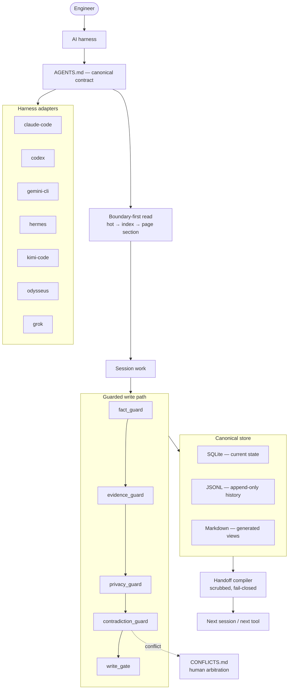

# Architecture

Zeref sits between an AI harness and a project's memory files. The harness supplies the model and the editor. Zeref supplies the memory, the guards, and the policy that decides what may be written and what may leave the machine.

`AGENTS.md` is the canonical behavior contract. Every harness-specific file is a thin stub that defers to it.

## Overview

## The canonical store invariant

"What is the source of truth?" has exactly one answer, and every other surface is derived from it.

| Layer | Role | Editable by hand |
|---|---|---|
| SQLite | Canonical current state. | No |
| JSONL | Canonical append-only history. | No — appended, never rewritten |
| Markdown | Generated human-readable view. Carries a do-not-edit header. | No |
| TOON | Optional generated model-input view. | No |

Recorded in [`docs/adr/ADR-0001-canonical-store.md`](https://github.com/kanadhiayash/zeref-memory-engine/blob/main/docs/adr/ADR-0001-canonical-store.md).

## The guarded write path

Five guards live in `zeref/guards/`. A claim that fails any one of them does not reach the store.

| Guard | Rejects |
|---|---|
| `fact_guard` | Unsupported superlatives and unsourced absolute claims. |
| `evidence_guard` | Claims whose evidence is missing or graded below the required threshold. |
| `privacy_guard` | Payloads carrying redactable content for the active privacy mode. |
| `contradiction_guard` | Claims that conflict with stored state — routed to arbitration rather than dropped. |
| `write_gate` | Anything that has not cleared the preceding guards. |

The ordering matters: a claim is checked for support before it is checked for evidence, scrubbed before it is compared against stored state, and admitted only at the end.

### Contradiction handling

When the contradiction guard fires, the write halts. Both the incoming claim and the stored one are recorded with their provenance in `memory/CONFLICTS.md`, and the conflict waits for a human.

Four resolutions are refused by design:

| Refused shortcut | Why |
|---|---|
| Recency-wins | Newer is not truer. |
| Grade-wins | A better-sourced claim can still be the wrong one for this project. |
| Silent-drop | Discards information without a decision being made. |
| Indefinite-snooze | Defers forever, which is a decision wearing a delay's clothing. |

### Evidence grading

Two scores are stored separately and never collapsed into one. **Evidence quality** grades the source — provenance, directness, recency, authority, corroboration, reproducibility. **Review robustness** grades the deliberation — method diversity, independent agreement, recorded dissent.

Agreement among reviewers never upgrades weak source evidence to a strong grade. Confidence in a process is not evidence about the world.

## Boundary-first reads

A session does not load a project to answer a question about the project.

1. Read `memory/hot.md` — current context, kept short.
2. Read `memory/index.md` only if hot is insufficient — locate the relevant domain.
3. Read only the named section of the named page.
4. Never load a full page just to scan it.

Read cost is a function of the question, not of how long the project has been running. See [[Memory-Model]].

## Harness adapters

An adapter detects a harness, reports its health, and projects context into the file that harness reads. The registry covers `claude-code`, `codex`, `gemini-cli`, `hermes`, `kimi-code`, `odysseus`, and `grok`.

Adapter modules are imported lazily. An adapter whose module is absent surfaces as `detected=false` with a stated reason rather than raising an import error, so a partial install degrades legibly instead of crashing.

### Enforcement levels

Every integration declares how strongly Zeref can actually govern it. The label is part of the contract, so no doc claims control that the execution path does not support.

| Level | Meaning |
|---|---|
| Embedded | Zeref intercepts or authorizes operations through native hooks, plugins, lifecycle callbacks, or controlled subprocesses. |
| Sidecar / proxy | Zeref enforces only work explicitly routed through its own CLI, MCP server, API, or proxy. |
| Context-only | Zeref can generate instructions and memory context but cannot guarantee enforcement. |

## Handoff compilation

Handoff artifacts are compiled from stored atoms and scrubbed on the way out. Five targets are supported: `codex`, `claude`, `cursor`, `github`, and `human`.

Export is fail-closed by privacy class:

| Class | Default export | With private export requested |
|---|---|---|
| `public-safe` | Exported | Exported |
| `private` | Withheld | Exported |
| `unknown` | Withheld | Exported |
| `local-only` | Never exported | Never exported |

Treating `unknown` exactly like `private` is deliberate: an atom whose privacy class was never asserted must not leak merely because nobody classified it.

## Reasoning classes and model routing

Core code and canonical schemas never name a vendor model. A task carries a criticality; criticality resolves to a reasoning class; a provider descriptor maps the class to a concrete model at the edge.

| Criticality | Entitled class |
|---|---|
| LOW | `fast` |
| MEDIUM | `balanced` |
| HIGH | `deep` |
| CRITICAL | `frontier` |

`local` and `private` are placement constraints — run on-device, or run in a privacy-restricted context — rather than cost tiers, and are permitted at any criticality.

Entitlement is enforced in `zeref/core/reasoning.py`, not in prose. A request may always downgrade to a cheaper class and never upgrade; `frontier` requires CRITICAL. A violation raises `ReasoningPolicyError` rather than emitting a warning.

Provider descriptors are declarative JSON files in `zeref/adapters/providers/`, one per provider, shipped for `anthropic` and `openai`. Each maps reasoning classes to model IDs and optional effort levels. Adding a provider means adding a JSON file.

**Zeref does not call model APIs.** It decides what class of model a task is entitled to; the harness performs the inference.

## Benchmarks

Two distinct things live under `benchmarks/`.

**Internal quality axes.** A deterministic suite scores this repository against its own rubric on axes including portability, adaptivity, scalability, retrieval, and trust. These are internal quality axes used as release gates — not benchmark rankings, and not comparable to another system's numbers.

**External benchmark scaffolding.** Loaders exist for five public suites — LoCoMo, LongMemEval, PersonaMem, RULER, and HELMET — in `benchmarks/external/loaders/`. No dataset runs have been performed and no scores exist. The loaders and baselines are scaffolding only, and their presence implies no result, ranking, or comparison.

Suites that were considered and are not supported are listed with reasons in [`benchmarks/external/UNSUPPORTED.md`](https://github.com/kanadhiayash/zeref-memory-engine/blob/main/benchmarks/external/UNSUPPORTED.md).

## Release gating

Release checks execute the test suite and the internal benchmark suite live rather than reading a stored verdict.

The trust axis accepts an independent re-grade only when that re-grade names the commit it graded. If the recorded commit does not match `HEAD`, the override is refused and the deterministic draft publishes instead — a stale grade cannot silently apply to newer code. See [`docs/TRUST_AUDIT.md`](https://github.com/kanadhiayash/zeref-memory-engine/blob/main/docs/TRUST_AUDIT.md).

## Component status taxonomy

Every component carries a label so nothing claims capability it does not have.

| Status | Meaning |
|---|---|
| `runtime` | Backed by executing code with test coverage. |
| `adapter` | A provider, harness, or capability bridge — thin, declarative, swappable. |
| `contract` | A schema, manifest, or spec describing required behavior, not necessarily runtime-backed. |
| `experimental` | Implemented but not yet benchmarked past its acceptance threshold; may regress or be removed. |

## Surfaces

| Surface | Contents |
|---|---|
| `agents/` | Background roles: memory writer, privacy guardian, evidence curator, pattern observer, sync coordinator, handoff orchestrator. |
| `skills/` | On-trigger procedures: routing, contradiction resolution, evidence grading, handoff compilation, privacy abstraction, skill drafting. |
| `commands/` | User-facing command contracts. |
| `team-packs/` | On-demand multi-agent configurations. See [[Team-Packs]]. |
| `zeref/` | Python runtime — guards, adapters, store, privacy, locking, CLI. |
| `benchmarks/` | Internal quality suite and external loader scaffolding. |

## Related

- [[Memory-Model]] — layout, read discipline, event log
- [[Privacy-Model]] — modes, classes, export policy
- [[Team-Packs]] — multi-agent configurations
- [[Pattern-Detection]] — review-first extension
- [[Glossary]] — canonical terms
