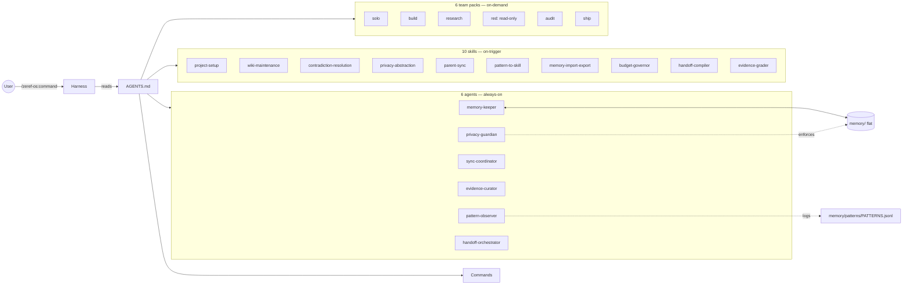

# Architecture

Zeref OS has four surfaces: **agents** (always-on roles), **skills** (on-trigger procedures), **commands** (user-facing slash entries), and **team packs** (on-demand multi-agent configurations).

`AGENTS.md` is the source of truth. Every harness-specific file is a thin stub.

## Overview diagram



## Agents (6 — always-on background roles)

| Agent | Auto-load | Role |
|---|---|---|
| `memory-keeper` | yes | Single writer to `memory/` wiki files. Reads boundary-first. Logs every write. |
| `privacy-guardian` | conditional | Enforces `PRIVACY.md` mode + `REDACT.md` classes + `SHARING_POLICY.md` allowlist. |
| `sync-coordinator` | on `/start` / `/stop` / `/sync-parent` | Permissions, tool visibility, parent push. |
| `evidence-curator` | conditional | Grades confidence, recency, provenance of every entry. |
| `pattern-observer` | background | Watches `PATTERNS.jsonl` for repeated work — surfaces candidate skills. |
| `handoff-orchestrator` | on `/stop` / model switch | Packages cross-harness handoff. |

Each agent has a YAML frontmatter file in `agents/<name>.md` declaring its model preference (`claude-haiku-4-5` by default; `sonnet` for conversational; `opus` for pattern-to-skill draft synthesis).

## Skills (10 — on-trigger procedures)

| Skill | Activation |
|---|---|
| `project-setup` | First `/start` or missing config |
| `wiki-maintenance` | After writes; consolidation |
| `contradiction-resolution` | When `memory-keeper` flags conflict |
| `privacy-abstraction` | Before writes when `PRIVACY.md` mode = `abstract` |
| `parent-sync` | Approved `/stop` or `/sync-parent` |
| `pattern-to-skill` | Threshold hit in `pattern-observer` |
| `memory-import-export` | Explicit migration request |
| `budget-governor` | `/start`, tier change, budget warning |
| `handoff-compiler` | Session end or model switch |
| `evidence-grader` | On write, review, sync, conflict |

## Commands (8)

```
/start              Boot session; restore context (hot.md → index.md per §0)
/done               Persist work; refresh hot.md; conflict scan; snapshot
/stop               End session; optional parent push; optional handoff compile
/status             Read-only state report
/team [type]        Activate on-demand team pack
/sync-parent        Manual parent rollup
/reset-permissions  Clear session overrides
/review-skill       Review pattern-detected skill drafts in skills/drafts/
```

## Team packs (6)

See [[Team-Packs]] for full descriptions.

| Team | Roster | Use |
|---|---|---|
| solo | 1 primary + memory engine | default |
| build | Planner + Implementer + Reviewer | multi-module features |
| research | Investigator + Synthesizer + Fact-checker | tech evaluation |
| red | Attacker + Security reviewer + Constraint checker + Evidence recorder (read-only) | adversarial review |
| audit | Reader + Linter + Quality gate | pre-ship QA |
| ship | Changelog drafter + Release reviewer + Deploy verifier | release prep |

Max 4 agents per pack. Outputs always land in `team/` (never inline-only).

## File tree

```
project-root/
├── AGENTS.md              ← canonical
├── CLAUDE.md / GEMINI.md  ← harness stubs (defer to AGENTS.md)
├── PRIVACY.md / REDACT.md / SHARING_POLICY.md
├── agents/<6>.md
├── skills/<10>/SKILL.md
│   └── drafts/            ← pattern-detected, pending approval
├── commands/<8>.md
├── team-packs/<6>.md
├── team/                  ← team pack outputs
├── memory/                ← flat layout (see Memory-Model page)
├── config/                ← PROJECT, PERMISSIONS, PARENT_SYNC, BUDGET, claude-overrides
├── references/            ← qa-gate, safety, two-strikes, advisories, v4x-canon
└── scripts/               ← validate, migrate
```

## Core principles (per `AGENTS.md`)

1. **Local-first** — canonical state is markdown on disk
2. **Privacy-first** — every write through `privacy-guardian`
3. **Boundary-first reads** — hot → index → page section
4. **Human arbitration** — contradictions surface, never silent
5. **Single-writer per resource** — only `memory-keeper` writes to wiki files
6. **Append-only logs** — `PATTERNS.jsonl` is never edited
7. **Progressive activation** — minimal agents auto-load; rest lazy
8. **Evidence discipline** — separate facts / assumptions / unknowns / risks
9. **Token discipline** — verbosity scales to model tier
10. **Review-first extension** — drafts to `skills/drafts/`, never auto-activated
11. **Two-Strikes Rule** — no rule on first occurrence of an error
12. **Harness Agnosticism** — AGENTS.md is source of truth
