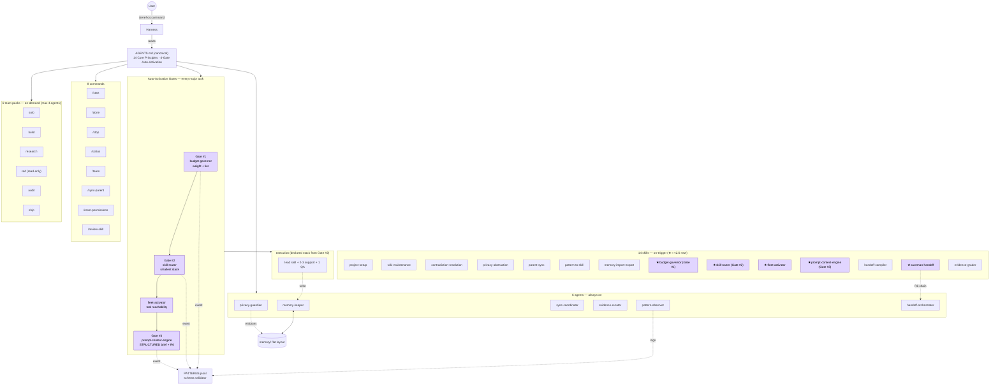

# Architecture

Zeref OS has six surfaces: **agents** (always-on roles), **skills** (on-trigger procedures), **commands** (user-facing slash entries), **team packs** (on-demand multi-agent configurations), **Auto-Activation Gates** (4-gate chain per major task), and **Model-Tier Routing** (weight → model matrix).

`AGENTS.md` is the source of truth. Every harness-specific file is a thin stub. **14 Core Principles**, **6 agents**, **14 skills**, **8 commands**, **6 team packs**, **4 Auto-Activation Gates** active.

_Placeholder: `assets/poc-gate-output.png` — sample inline gate declaration on a real task._

## Overview diagram



## Auto-Activation Gates (4-gate chain)

Every major task passes 4 sequential gates **before any execution-model token spend**. Each gate declares output inline; user can override.

| # | Gate | Output line format | Hard block |
|---|---|---|---|
| 1 | `budget-governor` | `[budget-governor] weight=<W> tier=<T> match=<OK\|MISMATCH> budget_remaining=$<n>` | CRITICAL never on Haiku; LOW flagged on Opus |
| 2 | `skill-router` | `[skill-router] domain=<D> lead=<L> support=[s1,s2] qa=<Q> ext=<E\|none>` | Stack > 5 skills rejected; fan-out refused |
| (companion) | `fleet-activator` | `[fleet-activator] <tool>: reachable\|UNREACHABLE-EMPTY-DIR\|UNREACHABLE-MISSING` | Marker-file check per tool (anti probe-spoof) |
| 3 | `prompt-context-engine` | `[prompt-context-engine] class=<C> action=<proceed\|assume\|restructure> brief_tokens=<n> injection_detected=<bool>` | Injection markers wrapped in `<context type="untrusted-input">` + `<sentinel>`; 60s irreversibility cool-down |
| (handoff) | `caveman-handoff` | `[caveman-handoff] orig=<n>tok compressed=<m>tok ratio=<r>% model_from=<X> model_to=<Y>` | NFKC normalize + homoglyph guard; R6 diff byte-equal AND NFKC-equal |

Each gate emits a typed event to `memory/patterns/PATTERNS.jsonl`. Validator parses event allowlist + per-event JSON-schema + value-enum checks. See `scripts/zeref-validate.py::lint_patterns_log()`.

## Model-Tier Routing

Per Core Principle 14: **LOW never on Opus; CRITICAL never on Haiku.** Weight (from `budget-governor`) maps to model + effort.

| Weight | Model | Effort | Typical $ / task | Examples |
|---|---|---|---|---|
| **CRITICAL** | `claude-opus-4-7` | high | $0.50 – $5.00 | `pattern-to-skill` draft, parent-sync export, architecture decision |
| **HIGH** | `claude-sonnet-4-6` | medium | $0.10 – $0.50 | `contradiction-resolution`, `handoff-compiler`, `project-setup` interview, `prompt-context-engine` restructure |
| **MEDIUM** | `claude-sonnet-4-6` low / `claude-haiku-4-5` medium | low / medium | $0.02 – $0.10 | `wiki-maintenance`, `evidence-grader`, `privacy-abstraction` |
| **LOW** | `claude-haiku-4-5` | low | < $0.02 | `budget-governor` gate, `skill-router` gate, `fleet-activator` probe, single-fact lookup |

**Cascade pattern**: orchestrator @ Sonnet medium → executor @ Sonnet/Haiku by weight → final gate @ Opus high when stakes warrant.

**Model resolver**: bare aliases (`haiku`/`sonnet`/`opus`) resolve to full Anthropic ids via [`_shared/model-resolver.md`](https://github.com/kanadhiayash/zeref-os/blob/main/_shared/model-resolver.md). Opus 4.6 pinned for cost-sensitive flagship work (avoids 4.7 +35% tokenizer inflation).

## Agents (6 — always-on background roles)

| Agent | Auto-load | Role | Default model |
|---|---|---|---|
| `memory-keeper` | yes | Single writer to `memory/` wiki files. Reads boundary-first. Logs every write. Enforces R1 single-writer chain. | `claude-haiku-4-5` |
| `privacy-guardian` | conditional | Enforces `PRIVACY.md` mode + `REDACT.md` classes + `SHARING_POLICY.md` allowlist. Filters every external transmission. | `claude-haiku-4-5` |
| `sync-coordinator` | on `/start` / `/stop` / `/sync-parent` | Permissions, tool visibility, parent push orchestration. | `claude-haiku-4-5` |
| `evidence-curator` | conditional | Grades confidence (high/medium/low/unverified), recency, provenance of every entry. | `claude-haiku-4-5` |
| `pattern-observer` | background | Watches `PATTERNS.jsonl` for repeated work (48-80h window, Jaccard ≥0.8, ≥3 occurrences) — surfaces candidate skills via `pattern-to-skill`. | `claude-haiku-4-5` |
| `handoff-orchestrator` | on `/stop` / model switch | Packages cross-harness handoff. Hands off to `caveman-handoff` for compression. | `claude-sonnet-4-6` |

## Skills (14 — on-trigger procedures)

★ = new in v2.6.

| Skill | Activation | Tier |
|---|---|---|
| `project-setup` | First `/start` or missing config | SONNET (HIGH — interview) |
| `wiki-maintenance` | After writes; consolidation | HAIKU (MEDIUM) |
| `contradiction-resolution` | When `memory-keeper` flags conflict | SONNET (HIGH — arbitration) |
| `privacy-abstraction` | Before writes when mode = `abstract` | HAIKU (MEDIUM, deterministic rules) |
| `parent-sync` | Approved `/stop` or `/sync-parent` | SONNET (HIGH — irreversible push) |
| `pattern-to-skill` | Threshold hit in `pattern-observer` | OPUS (CRITICAL — code synthesis) |
| `memory-import-export` | Explicit migration request | SONNET (HIGH — schema crossing) |
| `budget-governor` ★ **Gate #1** | Auto-gate: every major task | HAIKU (LOW — classification) |
| `skill-router` ★ **Gate #2** | Auto-gate: every major task, after budget gate | HAIKU (LOW — routing) |
| `fleet-activator` ★ | Companion to `skill-router` when extended-tool hint present | HAIKU (LOW — probe) |
| `prompt-context-engine` ★ **Gate #3** | Auto-gate: every major task, after skill-router | SONNET (HIGH — restructure) |
| `handoff-compiler` | Session end or model switch | SONNET (HIGH — cross-harness) |
| `caveman-handoff` ★ | Companion to `handoff-compiler` for cross-model compression | HAIKU (LOW — mechanical compression) |
| `evidence-grader` | On write, review, sync, conflict | HAIKU (LOW-MEDIUM) |

## Commands (8)

```
/start              Boot session; restore context (hot.md → index.md per §0)
/done               Persist work; refresh hot.md; conflict scan; snapshot
/stop               End session; optional parent push; optional handoff compile
/status             Read-only state report
/team [type]        Activate on-demand team pack
/sync-parent        Manual parent rollup
/reset-permissions  Clear session overrides
/review-skill       Review pattern-detected skill drafts in skills/drafts/
```

## Team packs (6)

See [[Team-Packs]] for full descriptions.

| Team | Roster | Use |
|---|---|---|
| solo | 1 primary + memory engine | default |
| build | Planner + Implementer + Reviewer | multi-module features |
| research | Investigator + Synthesizer + Fact-checker | tech evaluation |
| red | Attacker + Security reviewer + Constraint checker + Evidence recorder (read-only) | adversarial review |
| audit | Reader + Linter + Quality gate | pre-ship QA |
| ship | Changelog drafter + Release reviewer + Deploy verifier | release prep |

Max 4 agents per pack. Outputs always land in `team/` (never inline-only).

## Core principles (14, per AGENTS.md)

1. **Local-first** — canonical state is markdown on disk
2. **Privacy-first** — every write through `privacy-guardian`
3. **Boundary-first reads** — hot → index → page section
4. **Human arbitration** — contradictions surface, never silent
5. **Single-writer per resource** — only `memory-keeper` writes to wiki files
6. **Append-only logs** — `PATTERNS.jsonl` is never edited
7. **Progressive activation** — minimal agents auto-load; rest lazy
8. **Evidence discipline** — separate facts / assumptions / unknowns / risks
9. **Token discipline** — verbosity scales to model tier
10. **Review-first extension** — drafts to `skills/drafts/`, never auto-activated
11. **Two-Strikes Rule** — no rule on first occurrence of an error
12. **Harness Agnosticism** — AGENTS.md is source of truth
13. ★ **Cost-Weight Auto-Gate** — `budget-governor` runs before every major task; CRITICAL cannot proceed without stated tier
14. ★ **Task-Weight Model Routing** — LOW never on Opus; CRITICAL never on Haiku

## Shared rules (`_shared/rules.md`)

- **R1** Single-Writer + Privacy Gate — all `memory/` writes pass through `memory-keeper` → `privacy-guardian`
- **R2** Non-Deletion — archive content; never hard-delete
- **R3** Privacy Gate on External Output — `privacy-abstraction` rewrites payload when mode = abstract; blocks when local-only
- **R4** Never Invent — leave blank with `# TODO`, never fabricate
- **R6** ★ Zero Context Loss — every fact / entity / constraint from raw prompt survives restructure / routing / handoff; verified by diff
