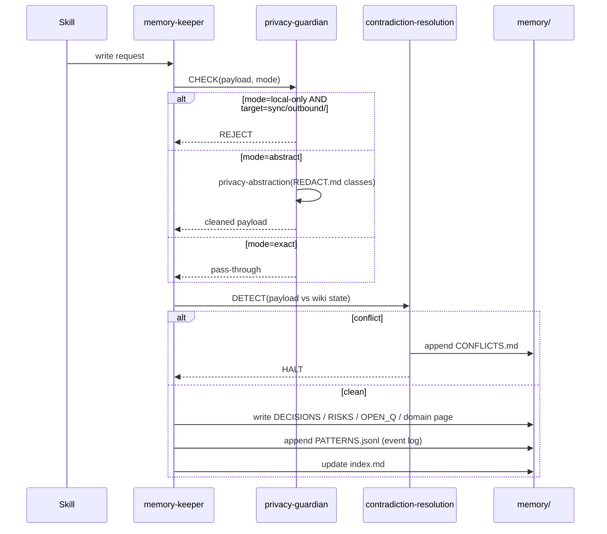

# Memory Model

Flat. Local. Markdown.

## Layout

```
memory/
├── hot.md                  ≤500 words — last 3 sessions. Read FIRST.
├── index.md                Domain index. Read if hot insufficient.
├── MEMORY.md               Agent-written session notes. First 200 lines auto-load.
├── DECISIONS.md            Confirmed decisions + provenance + evidence grade
├── OPEN_QUESTIONS.md       Unresolved questions + owner
├── RISKS.md                Identified risks + severity
├── CONFLICTS.md            Contradiction queue (user arbitrates)
├── archive/                Superseded entries — never deleted (per D9)
├── patterns/
│   └── PATTERNS.jsonl      Append-only tool/event log
├── snapshots/<iso>/        Point-in-time wiki state + manifest.json
├── sync/
│   ├── outbound/           Staged parent updates
│   └── parent/             Received parent updates
└── raw/                    Untouched source material (transcripts, specs, dumps)
```

## Reading order (per ZEREF_OS §0)

Every session start:

1. **`memory/hot.md`** — ≤500 words; "what's currently in flight"
2. **`memory/index.md`** — domain index (only if hot insufficient)
3. **`PRIVACY.md`** (root) — before any write or tool use
4. **`REDACT.md`** (root) — before any external output
5. **`memory/MEMORY.md`** first 200 lines — agent-written context
6. **`memory/patterns/PATTERNS.jsonl`** last 3 entries — recent events
7. Individual wiki pages — ONLY when domain specifics are needed

Never load a full wiki page just to scan it.

## Write protocol



## Single-writer discipline

Only `memory-keeper` writes to:
- `memory/hot.md`, `index.md`, `DECISIONS.md`, `OPEN_QUESTIONS.md`, `RISKS.md`, `CONFLICTS.md`, `MEMORY.md`

Any other agent attempting these paths is blocked and the violation is logged.

`memory/patterns/PATTERNS.jsonl` is append-only by any agent.

## Boundary-first reads

```
✗ Wrong:  read memory/DECISIONS.md           (whole page)
✓ Right:  read memory/hot.md
          → if needed: read memory/index.md
          → find domain row
          → read named section of named page
```

This is enforced by skill discipline and tracked by `budget-governor`. Loading full pages blows the token budget.

## Contradiction handling

When `memory-keeper` detects a conflict:

1. **Halt** the write.
2. **Append** both sides to `memory/CONFLICTS.md` with provenance.
3. **Surface** to user: "Resolve now / snooze-until-done / both-valid?"
4. **User arbitrates** — never silent resolution.
5. On resolution: winner moves to `memory/DECISIONS.md` with both-sides provenance. Loser marked `[SUPERSEDED]` in source page. Never deleted.

Conflict types detected:

| Type | Example |
|---|---|
| Direct negation | "DB is Postgres" vs "DB is MySQL" |
| Mutually exclusive | "Ship Friday" vs "Ship next Monday" |
| Quantitative drift | "Budget $50k" vs "Budget $80k" (>20% delta) |
| Decision supersession | New decision overrides still-active decision |
| Source disagreement | Two pushed-in claims disagree |

## MEMORY.md (agent-written)

`AGENTS.md` is human-written, agent-read.
`memory/MEMORY.md` is agent-written, agent-read.

Auto-hygiene on every `/done`: relative time anchors become absolute dates (per ZEREF_OS §3.4).

Rule: treat your own memory as a hint, not a fact. Verify against actual code before acting.

## Evidence grading

Every entry carries a grade:

| Grade | Criteria |
|---|---|
| **high** | Verified this session OR confirmed by user OR backed by primary source |
| **medium** | Reasonable inference, named source, < 30 days old |
| **low** | Unverified assumption OR > 90 days old OR derived from indirect source |

`evidence-curator` re-grades on staleness. Decisions destined for `DECISIONS.md` must be high or medium; low rejected for user confirmation.

## Snapshots

On every `/done`: snapshot `memory/` (excluding `archive/`) → `memory/snapshots/<iso>/` with `manifest.json` (ts, event cursor, wiki state hash).

Snapshots are never overwritten. Each gets a unique ISO timestamp.

## Migration history

Path changes preserved in [`MIGRATION.md`](https://github.com/kanadhiayash/zeref-os/blob/main/MIGRATION.md):

- v3 → v4: `scripts/migrate-v3-to-v4.py`
- v4.0–v4.2 (nested `memory/wiki/`) → v4.3 (flat): `scripts/migrate-v4.2-to-v4.3.py`
- v4.3 → Zeref OS v1.0.0: no data migration; only plugin name change
