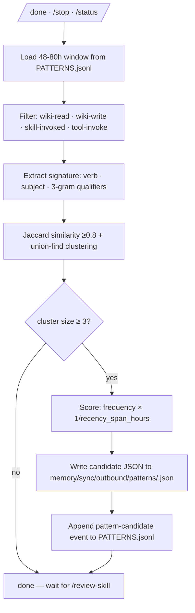

# Pattern Detection

Two systems work together:

1. **`pattern-observer`** — background scanner over `memory/patterns/PATTERNS.jsonl`. Detects repeated work signatures.
2. **`pattern-to-skill`** — invoked manually via `/zeref-os:review-skill`. Drafts skills from detected patterns to `skills/drafts/`. **Never auto-activates.**

Plus a third overarching rule:

3. **Two-Strikes Rule** — never codify a rule on the first occurrence of an error. See [Glossary](Glossary).

## Algorithm



## Window + threshold

| Parameter | Value | Source |
|---|---|---|
| Rolling window | **48–80h** | ZEREF_OS §3.5, D4 |
| Repetition threshold | **3×** | ZEREF_OS §3.5, D4 |
| Jaccard similarity | **≥ 0.8** | community pattern |

User can disable via `config/BUDGET.md` `pattern_detection: false`.

## Task signature

For each event, extract:

```
verb         action root (e.g. "use", "fetch", "summarize")
subject      noun phrase (target file basename, domain, or summary subject)
qualifiers   3-grams from payload summary (lowercase, alphanumeric, stop-words removed)
```

Example:
```
event:    wiki-write
target:   memory/DECISIONS.md
payload:  {"summary": "Use Postgres for user accounts service"}

→ signature:
  verb:        "use"
  subject:     "postgres"
  qualifiers:  ["use postgres user", "postgres user accounts", "user accounts service"]
```

## Clustering

Pairwise Jaccard similarity over qualifier 3-gram sets:

```
J(A, B) = |A ∩ B| / |A ∪ B|
```

Verb + subject must match (exact or stemmed). If `J ≥ 0.8`, events are similar. Union-find groups similar events into clusters. Clusters with size < 3 are discarded.

## Scoring

```
score = frequency × (1 / recency_span_hours)
```

Favors dense recent repetition over sparse old repetition.

## Candidate emission

For each surviving cluster, write JSON to `memory/sync/outbound/patterns/<cluster-id>.json`:

```json
{
  "schema_version": "1.0",
  "cluster_id": "<sha256-of-member-hashes>",
  "detected_at": "<iso>",
  "size": 5,
  "verb": "use",
  "subject": "postgres",
  "qualifiers_top": ["use postgres user", "..."],
  "members": [
    {"event_hash": "sha256:...", "ts": "...", "payload_summary": "..."}
  ],
  "suggested_skill_name": "use-postgres-pattern",
  "score": 12.4
}
```

Then append a `pattern-candidate` event to `PATTERNS.jsonl`.

## Drafting (`pattern-to-skill`)

User runs `/zeref-os:review-skill`. For each new candidate:

1. Load candidate JSON.
2. Synthesize skill metadata (`name`, `description`, `trigger`, `model`, `max_turns`, `provenance`).
3. Synthesize skill body (mission, when-to-use, operations, safety).
4. Write to `skills/drafts/<name>/SKILL.md` + immutable `PROVENANCE.md`.

Then per-draft prompt:

```
=== <name> ===
<description>
Provenance: <N> events in <hours>h, score <N>
[show frontmatter]
[show body]

Action? [approve / edit / reject / defer]
```

| Action | Effect |
|---|---|
| `approve` | `git mv skills/drafts/<name> skills/<name>`; strip `status: draft`; log event |
| `edit` | Open file for editing; re-prompt after save |
| `reject` | Prompt reason; `rm -rf` draft; mark candidate JSON with `rejected_at`; never re-surface |
| `defer` | Leave in place; auto-prompt after 3 defers |

## Two-Strikes Rule

**First occurrence of an error: log it. Second occurrence: promote to a rule.**

See [Glossary](Glossary) for full rule. Codified in [`references/two-strikes-rule.md`](https://github.com/kanadhiayash/zeref-os/blob/main/references/two-strikes-rule.md).

`pattern-observer`'s 3× threshold enforces this naturally — but for non-pattern rule creation, the Two-Strikes Rule applies manually.

## Safety

- Pattern detection is statistical — false positives expected, false negatives acceptable.
- All candidates queue in `memory/sync/outbound/patterns/` for user review via `/zeref-os:review-skill`.
- Never auto-creates a skill.
- Respects `PRIVACY.md` mode: `local-only` keeps patterns local; never pushed via parent-sync.
