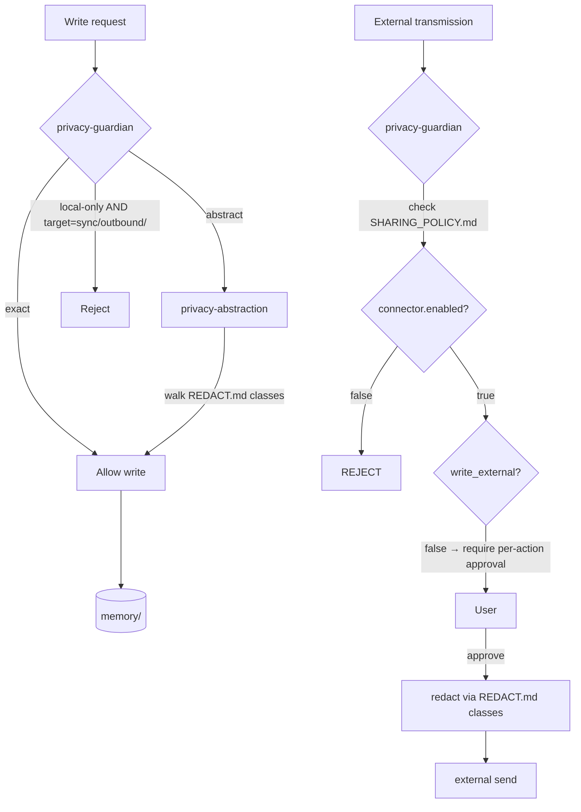

# Privacy Model

Three root files. Local-first by default. Connectors OFF by default.

## The three files

### `PRIVACY.md` — modes

| Mode | Behavior |
|---|---|
| `exact` | Write full detail. Only when user explicitly enables per project. |
| **`abstract`** *(default)* | `privacy-abstraction` skill rewrites payload before write |
| `local-only` | Block all writes to `memory/sync/outbound/` and `memory/sync/parent/` |

### `REDACT.md` — sensitive classes

| Class | Default | Replacement strategy |
|---|---|---|
| `credentials` | **always on** | full removal → `<REDACTED:credential>` |
| `pii` | enabled | hash-based pseudonym → `<user:a3f9>` |
| `internal_paths` | enabled | repo-relative — `/Users/x/proj/foo` → `<repo>/foo` |
| `client_data` | off (enable per project) | full removal or pseudonym |
| `financial` | off | bucket — `$1,234,567` → `<order:$1M-10M>` |
| `proprietary_code` | off | full removal → `<REDACTED:internal>` |

User can add custom classes; routes through `skills/privacy-abstraction/SKILL.md`'s regex library.

### `SHARING_POLICY.md` — connector allowlist

All connectors **OFF** by default. To enable:

```yaml
connectors:
  github:
    enabled: false           # flip to true
    read_project_context: false
    allowed_surfaces: []     # [issues, prs, repo_metadata]
    redact_classes: [credentials, pii, internal_paths]
```

Recommended connectors live in [`references/connector-advisory.md`](https://github.com/kanadhiayash/zeref-os/blob/main/references/connector-advisory.md). Zeref OS recommends a connector only after `pattern-observer` detects repeated manual behavior.

## Flow



## Always-block (regardless of mode)

- Credentials, API keys, tokens (any form)
- Contents of `.gitignore`-matched files
- Raw clipboard content (unless explicitly captured to `memory/raw/`)
- Anything matched by enabled classes in `REDACT.md`

## Local-First Canonical Rule (§4.4)

- Local markdown files are the canonical memory. Always.
- Notion, Linear, GitHub, Slack are connected surfaces, not source-of-truth memory.
- Switching harnesses requires no reconfiguration of memory because memory is files.

## External transmission

Zeref OS **never** transmits wiki content to any external service unless user explicitly approves per action.

`privacy-guardian` runs over outbound payload using the per-connector `redact_classes` list before sending.

## Per-session overrides

Use `/zeref-os:reset-permissions` to clear session overrides and restore defaults from `PRIVACY.md` + `SHARING_POLICY.md`.

## Uncertainty handling

If `privacy-abstraction` cannot classify with high confidence:

1. HALT the write.
2. Surface to user: "Cannot classify `<snippet>`. Treat as: [credentials | pii | safe | skip]?"
3. Never silently include uncertain content.

## Recommendations (not bundles)

Per ZEREF_OS §9 and D11 — Zeref OS ships **zero** bundled MCP tools. Recommendation-only. See [Inspirations](Inspirations) for what's available externally.
