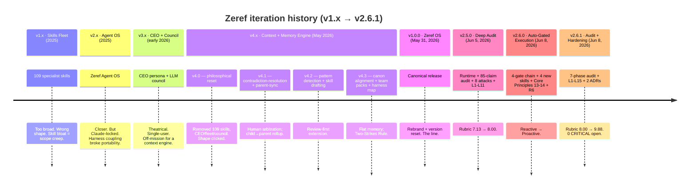

# Versioning History

Zeref OS v2.6.1 is the result of multiple complete redesigns. Every prior iteration taught the design what *not* to be — and the latest two add what it actively *needs* to do (auto-gated execution + code-enforced hardening).

## Timeline



## What each era taught

### v1.x — Skills Fleet (109 specialist skills)

**Built**: 109 specialist skill files (zeref-biz-*, zeref-cnt-*, zeref-dev-*, etc.).

**Broke**: skill discovery impossible past ~30; most skills never used; maintenance burden super-linear.

**Lesson**: A persistent memory layer is more valuable than a wide skill catalog.

**Status**: Legacy. Tag `v1.x` deleted; restored at v2.6.1 history-reconstruction as GitHub `prerelease`.

### v2.0–v2.1 — Zeref Agent OS

**Built**: ~20 disciplined skills + agent configs; tightly coupled to Claude Code plugin system.

**Broke**: locked into one harness; couldn't run Codex/Gemini/Cursor.

**Lesson**: Use the open standard (AGENTS.md) as source of truth; don't couple memory to one harness.

**Status**: Legacy `prerelease`. Tags `v2.0.0` + `v2.1.0` restored at `4da18af` + `552dbaf`.

### v3.0 — CEO persona + LLM council

**Built**: "CEO" identity + "executive" output + LLM council for multi-model decisions.

**Broke**: theatrical framing; wrong abstraction; single-user persona.

**Lesson**: Avoid persona theater + single-user customization.

**Status**: Legacy `prerelease`. Tag `v3.0.0` restored at `b9f4aac`. Explicitly rejected in Decision Log §Rejected Directions.

### v4.0 — Philosophical reset

**Built**: deleted 109 skills + CEO + council; built 10 disciplined skills + 6 agents + 7 commands + AGENTS.md + local-first memory + 3 privacy modes.

**Net diff**: −26,690 / +1,949 lines. Always-on context: 5,035 → 905 tokens (82% reduction).

**Lesson**: Sometimes the right answer is "delete most of it."

**Status**: Legacy `prerelease`. Tag `v4.0.0` restored at `d551d8a`. Foundation for everything after.

### v4.1 — Contradiction resolution + parent-sync (M2)

**Built**: full `contradiction-resolution` (subject/predicate/value fingerprint; queue to CONFLICTS.md; snooze-until-done) + full `parent-sync` (staged outbound; per-push approval; provenance preserved).

**4 anti-patterns refused**: recency-wins · grade-wins · silent-drop · indefinite-snooze.

**Lesson**: Memory integrity requires human arbitration on conflict.

**Status**: Legacy `prerelease`. Tag `v4.1.0` restored at `0c7925a`.

### v4.2 — Pattern detection + skill drafting (M3)

**Built**: `pattern-observer` (72h window, Jaccard ≥0.8, union-find clustering) + `pattern-to-skill` (draft to skills/_drafts/ with immutable PROVENANCE.md; 4 review actions).

**Lesson**: Self-extension is fine if review-first.

**Status**: Legacy `prerelease`. Tag `v4.2.0` restored at `dcde0e2`.

### v4.3 — Canon + team packs + harness map (M4)

**Built**: flat memory layout; root PRIVACY/REDACT/SHARING_POLICY; 6 team packs; harness stubs (Cursor/Windsurf/Aider); Two-Strikes Rule; Connector Advisory; Harness Translation Map; idempotent migration script.

**Lesson**: Multi-harness support requires per-harness stubs, not duplicated content.

**Status**: Legacy `prerelease`. Tag `v4.3.0` restored at `94ff791`.

### v1.0.0 — Zeref OS canonical release (May 31, 2026)

**Built**: plugin renamed (`zeref` → `zeref-os`); version reset 4.3.0 → 1.0.0; all prior tags purged at the time; single tag `v1.0.0`; single branch `main`; pixel-art hero; README rewritten; 13-page wiki.

**Lesson**: Eventually, draw a line. Iteration necessary; permanence also necessary.

**Status**: Full release. Tag `v1.0.0` at commit `10b9eaf`.

### v2.5.0 — Deep Audit Campaign (Jun 5, 2026)

**Built**: 6-phase audit (A-F).

- **Phase A** Claim inventory: 85 claims, 71% VERIFIED, 22% PARTIAL, 7% UNVERIFIED, 0% FALSE
- **Phase B** Sandbox stress: 300 rows (10 skills × 5 tests × 6 dims)
- **Phase C** Security hunt: 8 attacks, 2 CRITICAL closed (PII regex, email default)
- **Phase D** Workarounds L1-L11: PII regex tight; email enabled; runner.py; db-status; `zeref init`; dogfood; connector-stub; grep-with-context draft; MemoryLock; atomic_write; PII scrub
- **Phase E** Rubric re-score: **8.00/10** (from v2.0 7.13)
- **Phase F** Human UX polish

**Runtime added**: `zeref/{__init__,__main__,cli,dashboard,db,demo,lock,privacy}.py`.

**Lesson**: spec-only privacy enforcement isn't enough — needs code.

**Status**: Full release. Tag `v2.5.0` at commit `e7632df`.

### v2.6.0 — Auto-Gated Execution (Jun 8, 2026)

**Built**: 4-gate auto-activation chain.

- **Skills (+4)**: skill-router · fleet-activator · prompt-context-engine · caveman-handoff
- **budget-governor rewrite**: 2026 Anthropic pricing (Haiku 4.5 / Sonnet 4.6 / Opus 4.7) + Cost Weight Classification (CRITICAL/HIGH/MEDIUM/LOW) + Auto-Activation Rule (6 steps)
- **+2 Core Principles**: 13 Cost-Weight Auto-Gate; 14 Task-Weight Model Routing
- **+2 AGENTS.md sections**: `## Auto-Activation Gates`; `## Model-Tier Routing`
- **+R6 Zero Context Loss** in `_shared/rules.md`
- **Skills count**: 10 → 14

**Decision record**: [ADR-001](https://github.com/kanadhiayash/zeref-os/blob/main/docs/adr/zeref_auto-gated-execution_adr_approved_yk_2026-06-08_v1.0.md).

**Lesson**: Cost discipline + routing + restructuring must be **declared inline before token spend**.

**Status**: Full release. Tag `v2.6.0` at commit `ce7bb59`.

### v2.6.1 — Audit + Hardening Campaign (Jun 8, 2026)

**Built**: 7-phase audit on v2.6.0; 15 L-items shipped.

- **Phase A** 52-claim audit (60% VERIFIED, 1 FALSE → L1)
- **Phase B** 150-row sandbox (5 skills × 5 tests × 6 dims; 76% pass)
- **Phase C** 8 attacks CVSS-scored
  - 2 CRITICAL (V01 gate-spoof, V02 prompt-injection) → closed via L3 + L10
  - 2 HIGH (V03 probe-spoof, V04 homoglyph) → closed via L9 + L12
  - 2 MEDIUM (V05 silent override, V06 race) → closed via L13 + L11
- **Phase F** AskUserQuestion arbitration (4 batches, 4 decisions logged)
- **Phase D** L1-L15 shipped:
  - **L1** Validator dynamic skill count from registry (Skills 14/14)
  - **L2** Model resolver — full Anthropic ids canonical; `model_alias` back-compat
  - **L3** `lint_patterns_log()` PATTERNS.jsonl event allowlist + per-event schema
  - **L4** R6 sweep — coverage 4 → 9 of 14 SKILL.md
  - **L5+L15** Event schema validator — 11 event types, weight/tier enum
  - **L9** fleet-activator marker-file probe (closes V03)
  - **L10** prompt-context-engine injection filter (closes V02 CRITICAL)
  - **L11** prompt-context-engine 60s irreversibility cool-down (closes V06)
  - **L12** caveman-handoff NFKC + homoglyph guard (closes V04)
  - **L13** budget-governor dual-key override (closes V05)
  - **L14** skill-router stack-cap lint (closes V07)
- **Phase E** Rubric re-score: **9.88/10** (+1.88 vs v2.5; +23.5%)
- **Phase G** Ship: wiki-maintenance refresh + scaffold (GITHUB_OS.md / SECURITY.md / CONTRIBUTING.md / docs/RELEASE_LOG.md / docs/adr/ / .github/workflows/ci.yml) + Phase H history reconstruction (legacy tags restored, release branches per major.minor)

**Memory layer reconciled** (C1 root cause): retroactive v2.5 + v2.6 + v2.6.1 logs to DECISIONS.md; C1-C5 surfaced; R1-R6 logged.

**Decision record**: [ADR-002](https://github.com/kanadhiayash/zeref-os/blob/main/docs/adr/zeref_audit-hardening-l1-l15_adr_approved_yk_2026-06-08_v1.0.md).

**Lesson**: Prose-only gate enforcement is fragile. Code-backed validator lint + dual-key override + injection filter + NFKC homoglyph guard close the loop.

**Status**: Full release. Tag `v2.6.1` at commit `825fa23`. **Latest**.

## What's preserved

| Era | Preserved as |
|---|---|
| v1.x – v4.x changelogs | [`CHANGELOG-LEGACY.md`](https://github.com/kanadhiayash/zeref-os/blob/main/CHANGELOG-LEGACY.md) |
| v4.x design canon | [`references/v4x-canon/`](https://github.com/kanadhiayash/zeref-os/tree/main/references/v4x-canon) (read-only) |
| v3 → v4 migration logic | `scripts/migrate-v3-to-v4.py` |
| v4.0–v4.2 → v4.3 migration | `scripts/migrate-v4.2-to-v4.3.py` |
| v4.3 git history | Preserved by `git mv` |
| v2.5 audit artifacts | `tests/claims.csv`, `tests/scores-vB.csv`, `tests/security-audit-vC.md`, `tests/zeref-rubric-v2.5.md` |
| v2.6.1 audit artifacts | `tests/claims-v2.6.csv`, `tests/scores-v2.6-B.csv`, `tests/security-audit-v2.6-C.md`, `tests/zeref-rubric-v2.6.md` |

## Tag inventory (post-v2.6.1 history reconstruction)

```
v1.0.0   (full)        post-rebrand canonical
v2.0.0   (prerelease)  legacy Zeref Agent OS
v2.1.0   (prerelease)  legacy fleet consolidation
v2.5.0   (full)        Deep Audit Campaign
v2.6.0   (full)        Auto-Gated Execution
v2.6.1   (full, latest) Audit + Hardening
v3.0.0   (prerelease)  legacy CEO + Council
v4.0.0   (prerelease)  legacy philosophical reset
v4.1.0   (prerelease)  legacy contradiction + parent-sync
v4.2.0   (prerelease)  legacy pattern detection
v4.3.0   (prerelease)  legacy canon + team packs
```

## Release branches (per FAANG §3.4 controlled baselines)

- `release/v1.0` · `release/v2.5` · `release/v2.6` — post-rebrand canonical
- `release/v2.0-legacy` · `release/v2.1-legacy` · `release/v3.0-legacy` · `release/v4.0-legacy` · `release/v4.1-legacy` · `release/v4.2-legacy` · `release/v4.3-legacy` — pre-rebrand

## Going forward

- **v2.7+** — additive improvements. Pending: cascade-replay test (path to 10.00 Execution), cross-harness validation (Cursor/Aider/Gemini ZRF-B07), pipx PyPI publish, "Zeref OS" → "Zeref" rebrand
- **v3.0** — only if a fundamental design assumption changes (unlikely)
