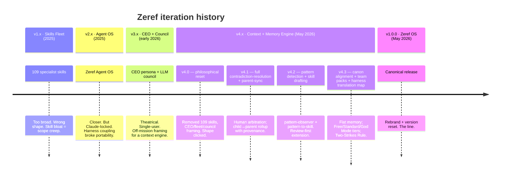

# Versioning History

Zeref OS v1.0.0 is the result of multiple complete redesigns. Every prior iteration taught the design what *not* to be.

## Timeline

## What each era taught

### v1.x — Skills Fleet (109 specialist skills)

**What we built:** A skills marketplace approach — 109 specialist skill files, each for a narrow workflow (zeref-biz-*, zeref-cnt-*, zeref-dev-*, etc.).

**What broke:**
- Skill discovery was impossible past ~30 skills.
- Most skills were never used.
- Maintenance burden grew super-linearly.
- "Skill fleet" was the wrong unit of composition.

**Lesson:** A persistent memory layer is more valuable than a wide skill catalog. Don't optimize for skill count.

**Status:** Archived. Tag deleted. Snapshot lives only in `CHANGELOG-LEGACY.md`.

### v2.0–v2.1 — Zeref Agent OS

**What we built:** Consolidated to ~20 disciplined skills. Added agent configurations. Coupled tightly to Claude Code's plugin system.

**What broke:**
- Locked into one harness (Claude).
- Couldn't run with Codex, Gemini, Cursor, etc.
- Portability promise broken.

**Lesson:** Don't couple memory to a specific harness. Use the open standard (AGENTS.md) as source of truth.

**Status:** Archived.

### v3.0 — CEO persona + LLM council

**What we built:** Added a "CEO" identity, an "executive" output style, and an "LLM council" pattern for multi-model decision-making. Customized for one user.

**What broke:**
- Theatrical framing got in the way of utility.
- Wrong abstraction — Zeref OS is a context engine, not a leader.
- Single-user persona limited adoption.

**Lesson:** Avoid persona theater. Avoid single-user customization. Avoid council-style decision overhead.

**Status:** Archived. Explicitly rejected in [Decision Log](Decision-Log) (Rejected Directions table).

### v4.0 — Philosophical reset

**What we built:** Removed everything. 109 skills, CEO persona, LLM council, fleet routers, executive QA — all gone. Replaced with: 10 disciplined skills, 6 agents, 7 commands, AGENTS.md as source of truth, local-first memory.

**Net diff: −26,690 lines / +1,949 lines. Always-on context: 5,035 → 905 tokens (82% reduction).**

**Lesson:** Sometimes the right answer is "delete most of it." The shape clicked at v4.0.

**Status:** Archived (tag deleted at v1.0.0 cutover). Foundational design captured in `references/v4x-canon/`.

### v4.1 — Contradiction resolution + parent-sync (M2)

**What we built:** Promoted two stubs to production:
- `contradiction-resolution` — subject/predicate/value fingerprint matching against `DECISIONS/OPEN_QUESTIONS/RISKS`. Halts write on conflict, queues to `CONFLICTS.md`, supports snooze-until-`/done`.
- `parent-sync` — stages to `memory/sync/outbound/<iso>/` with `manifest.json`, requires explicit approval per push, sets parent files chmod 444, supports rollback via provenance pointers.

**4 anti-patterns refused:** recency-wins · grade-wins · silent-drop · indefinite-snooze.

**Lesson:** Memory integrity requires human arbitration on conflict. Never silent resolve.

**Status:** Archived. Logic preserved in v1.0.0.

### v4.2 — Pattern detection + skill drafting (M3)

**What we built:** Closed the self-extension loop:
- `pattern-observer` — 48–80h rolling window scan with Jaccard 3-gram similarity ≥ 0.8 and union-find clustering.
- `pattern-to-skill` — drafts `SKILL.md` files to `skills/_drafts/` (later renamed `skills/drafts/`) with immutable `PROVENANCE.md`, requires explicit user review via `/review-skill` (approve/edit/reject/defer).

**Lesson:** Self-extension is fine if it's review-first. Never auto-activate.

**Status:** Archived. Logic preserved in v1.0.0.

### v4.3 — Canon alignment + team packs + harness translation map (M4)

**What we built:**
- Wholesale nomenclature adoption per `references/v4x-canon/ZEREF_OS.md` §12.
- Flat `memory/` layout (no more `memory/wiki/`).
- Root `PRIVACY.md` + `REDACT.md` + `SHARING_POLICY.md`.
- Six team packs (`team-packs/{solo,build,research,red,audit,ship}.md`) + `/team` command.
- Harness stubs for Cursor, Windsurf, Aider.
- Codified Two-Strikes Rule, Connector Advisory, Harness Translation Map.
- Imported v4.x design canon to `references/v4x-canon/`.

**92 files changed, +3207 / -400.**

**Lesson:** Drawing the design boundary explicitly (in `ZEREF_OS.md`) saves long-term confusion. Multi-harness support requires per-harness stubs, not duplicated content.

**Status:** Merged into v1.0.0.

### v1.0.0 — Zeref OS canonical release

**What changed:**
- Plugin renamed: `zeref` → `zeref-os`.
- Version reset: 4.3.0 → 1.0.0.
- All other tags purged. Single tag `v1.0.0` from this commit forward.
- All other branches purged. Single branch `main`.
- Pixel-art hero image added.
- README rewritten with full inspiration narrative.
- GitHub Wiki populated with 13 pages.

**Lesson:** Eventually, draw a line. Iteration is necessary; permanence is also necessary.

**Status:** Current.

## What's preserved

| Era | Preserved as |
|---|---|
| v1.x – v4.x changelogs | [`CHANGELOG-LEGACY.md`](https://github.com/kanadhiayash/zeref-os/blob/main/CHANGELOG-LEGACY.md) |
| v4.x design canon | [`references/v4x-canon/`](https://github.com/kanadhiayash/zeref-os/tree/main/references/v4x-canon) (read-only) |
| v3 → v4 migration logic | `scripts/migrate-v3-to-v4.py` |
| v4.0–v4.2 → v4.3 migration | `scripts/migrate-v4.2-to-v4.3.py` |
| v4.3 git history | Preserved by `git mv` (history continuity on renames) |

## What's gone (deleted at v1.0.0 cutover)

- Tags: v1.1, v2.0, v2.1, v3.0.0, v4.0.0, v4.1.0, v4.2.0, v4.3.0
- Branches: chore/remove-dependabot, chore/revert-test-commit, claude/quirky-ptolemy-b130ef
- Plugin name: `zeref` (replaced by `zeref-os`)

## Going forward

- **v1.x** — additive improvements, no breaking changes
- **v2.x** — only if a fundamental design assumption changes (unlikely)
